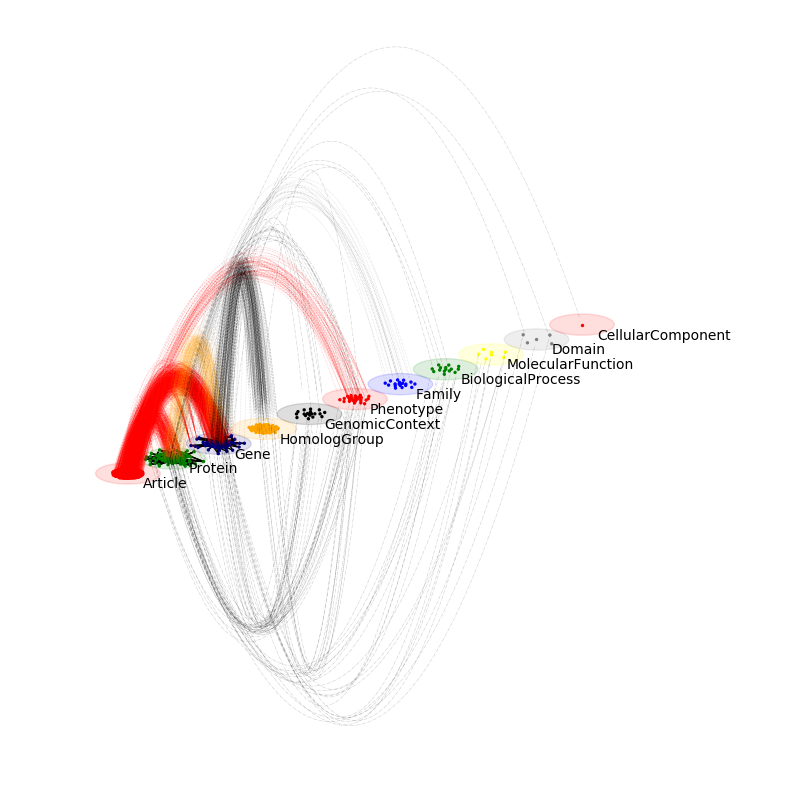

# *Py3Plex* - a library for analysis and visualization of heterogeneous networks

Heterogeneous networks are complex networks with additional information assigned to nodes or edges (or both). This library includes
some of the state-of-the-art algorithms for decomposition, visualization and analysis of such networks.


## Getting Started

To get started, please view **examples** folder.
Extensive documentation and quickstart tutorials are available at: [DOCS](https://py3plex.readthedocs.io/en/latest/)

For any errors, please open an issue!

### Contributions
If you are interested in contributing please:
- Either open a pull request
- Or write with your idea
- Or open an issue with your suggestion (feature requests welcome)


# Citations
```
@Article{Skrlj2019,
author={Skrlj, Blaz
and Kralj, Jan
and Lavrac, Nada},
title={Py3plex toolkit for visualization and analysis of multilayer networks},
journal={Applied Network Science},
year={2019},
volume={4},
number={1},
pages={94},
abstract={Complex networks are used as means for representing multimodal, real-life systems. With increasing amounts of data that lead to large multilayer networks consisting of different node and edge types, that can also be subject to temporal change, there is an increasing need for versatile visualization and analysis software. This work presents a lightweight Python library, Py3plex, which focuses on the visualization and analysis of multilayer networks. The library implements a set of simple graphical primitives supporting intra- as well as inter-layer visualization. It also supports many common operations on multilayer networks, such as aggregation, slicing, indexing, traversal, and more. The paper also focuses on how node embeddings can be used to speed up contemporary (multilayer) layout computation. The library's functionality is showcased on both real and synthetic networks.},
issn={2364-8228},
doi={10.1007/s41109-019-0203-7},
url={https://doi.org/10.1007/s41109-019-0203-7}
}


```
and
```
@InProceedings{10.1007/978-3-030-05411-3_60,
author="{\v{S}}krlj, Bla{\v{z}}
and Kralj, Jan
and Lavra{\v{c}}, Nada",
editor="Aiello, Luca Maria
and Cherifi, Chantal
and Cherifi, Hocine
and Lambiotte, Renaud
and Li{\'o}, Pietro
and Rocha, Luis M.",
title="Py3plex: A Library for Scalable Multilayer Network Analysis and Visualization",
booktitle="Complex Networks and Their Applications VII",
year="2019",
publisher="Springer International Publishing",
address="Cham",
pages="757--768",
abstract="Real-life systems are commonly represented as networks of interacting entities. While homogeneous networks consist of nodes of a single node type, multilayer networks are characterized by multiple types of nodes or edges, all present in the same system. Analysis and visualization of such networks represent a challenge for real-life complex network applications. The presented Py3plex Python-based library facilitates the exploration and visualization of multilayer networks. The library includes a diagonal projection-based network visualization, developed specifically for large networks with multiple node (and edge) types. The library also includes state-of-the-art methods for network decomposition and statistical analysis. The Py3plex functionality is showcased on real-world multilayer networks from the domains of biology and on synthetic networks.",
isbn="978-3-030-05411-3"
}

```
