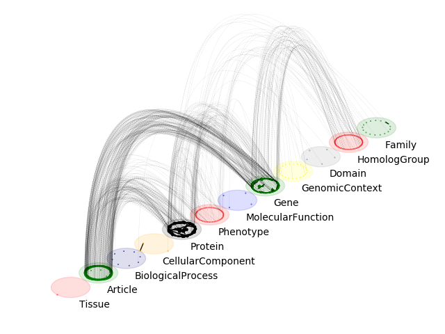
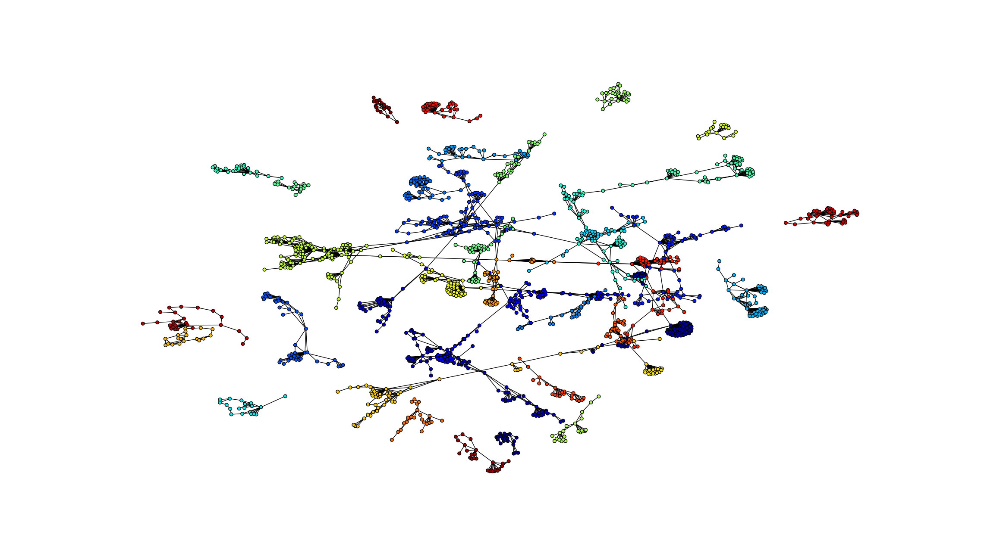
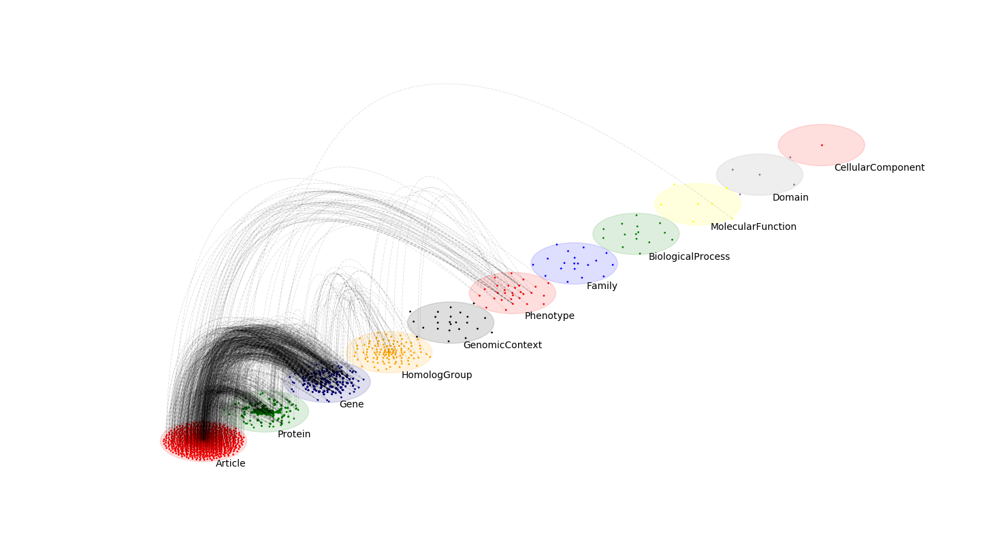
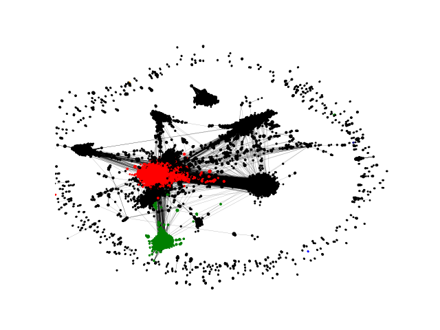
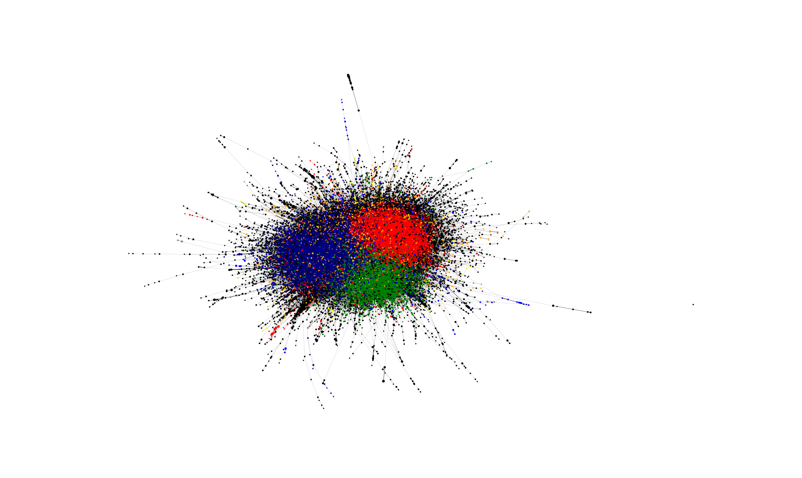
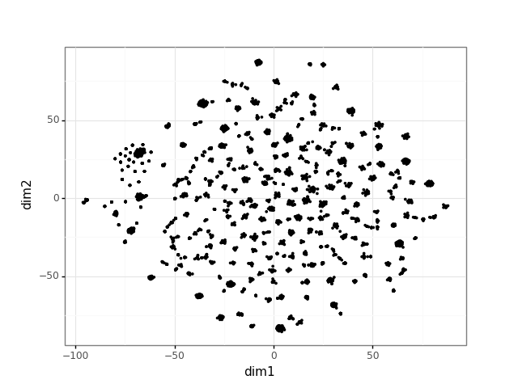

# *Py3Plex* - a library for analysis and visualization of heterogeneous networks

Heterogeneous networks are complex networks with additional information assigned to nodes or edges (or both). This library includes
some of the state-of-the-art algorithms for decomposition, visualization and analysis of such networks.


Heterogeneous (multilayer) networks             |  Homogeneous networks
:-------------------------:|:-------------------------:
  |  

## Getting Started

To get started, please view **examples** folder. Extensive documentation is available at: https://skblaz.github.io/Py3Plex/
### Prerequisites

1. Networkx (2.1)
2. Numpy (0.8)
3. Scipy  (1.1.0)
4. RDFlib (for ontology-based tasks) (any)
5. Cython (>0.28)

### Installing

To install, simply:

```
python3 setup.py install
```
For any errors, please, open an issue!

### Network construction and manipulation
This minimal example offers an intuitive API for multilayer(plex) network construction.

```python
## this example demonstrates how a network can be manipulated

from py3plex.core import multinet
from py3plex.core import random_generators

## An example general multilayer network
A = multinet.multi_layer_network()

## add a single node with type
simple_node = {"source" : "node1","type":"t1"}
A.add_nodes(simple_node)
A.monitor("Printing a single node.")
print(list(A.get_nodes(data=True)))

## add a single edge with type
simple_edge = {"source":"node1",
               "target":"node2",
               "type":"mention",
               "source_type":"t1",
               "weight" : 2, ## add arbitrary attributes!
               "target_type":"t2"}

A.add_edges(simple_edge)
A.monitor("Printing a single edge.")
print(list(A.get_edges(data=True)))

## multiple edges are added by simply packing existing edges into a list.
simple_attributed_edges = [{"source":"node1","target":"node6","type":"mention","source_type":"t1","target_type":"t5"},{"source":"node3","target":"node2","type":"mention","source_type":"t1","target_type":"t3"}]
A.add_edges(simple_attributed_edges)
A.monitor("Printing multiple edges")
print(list(A.get_edges(data=True)))

## Edges can also be added as lists: [n1,l1,n2,l2,w]
example_list_edge = [["node3","t2","node2","t6",1],["node3","t2","node2","t6",1]]

## specify that input is list, all else is recognized by Py3plex!
A.add_edges(example_list_edge,input_type="list")
print(list(A.get_edges()))
```
Random network generation is as simple as they come..
```python
A.monitor("Random ER multilayer graph in progress")
ER_multilayer = random_generators.random_multilayer_ER(300,6,0.05,directed=False)
ER_multilayer.visualize_network(show=True)

## dealing with multiplex networks
B = multinet.multi_layer_network(network_type="multiplex")
B.add_edges([[1,1,2,1,1],[1,2,3,2,1],[1,2,3,1,1],[2,1,3,2,1]],input_type="list")
```
Network indexing is now simple (multiple levels supported!)
```python

C = B.subnetwork([2],subset_by="layers")
print(list(C.get_nodes()))

C = B.subnetwork([2],subset_by="node_names")
print(list(C.get_nodes()))

C = B.subnetwork([(1,1),(1,2)],subset_by="node_layer_names")
print(list(C.get_nodes()))
```
Coupled edges can be obtained as follows (non-ordinal couplings only!)
```python

## coupled edges
B.monitor(list(B.get_edges(multiplex_edges=True)))

## non-coupled edges
B.monitor(list(B.get_edges(multiplex_edges=False)))

## visualize this toy example
B.visualize_network(show=True)

## nodes can also be removed easily
B.remove_edges([[1,1,2,1,1],[1,2,3,2,1],[1,2,3,1,1],[2,1,3,2,1]],input_type="list")
print(list(B.get_edges()))

B.remove_nodes([(1,1),(3,1)],input_type="list")
print(list(B.get_nodes()))

```

One of the simplest ways is list-based construction.., where
*[1,1,2,2,1]* cooresponds to node 1 on layer 1 connects with node 2 on layer 2, where the edge is *weighted as 1*. Note that node and layer names are**not** limited to integers, an example edge might also look like

```python
["person1","facebook","person2","twitter",2]
```

```python
## dealing with multiplex networks
B = multinet.multi_layer_network(network_type="multiplex")
B.add_edges([[1,1,2,1,1],[1,2,3,2,1],[1,2,3,1,1],[2,1,3,2,1]],input_type="list")

## coupled edges
B.monitor(list(B.get_edges(multiplex_edges=True)))

## non-coupled edges
B.monitor(list(B.get_edges(multiplex_edges=False)))

## visualize this toy example
B.visualize_network(show=True)

```

Py3plex also offers some random graph generators.

```python

A.monitor("Random ER multilayer graph in progress")
ER_multilayer = random_generators.random_multilayer_ER(300,6,0.05,directed=False)
ER_multilayer.visualize_network(show=True)

```

For more examples, please inspect the ./examples folder. For any questions, feature requests and similar, hesitate not to contact me!


### Examples

Here are some showcase examples! (**run from the ./examples folder!**)

**Some simple statistics**
```python

from py3plex.core import multinet
from py3plex.algorithms.statistics.basic_statistics import *

multilayer_network = multinet.multi_layer_network().load_network("../datasets/imdb_gml.gml",directed=True,input_type="gml")

stats_frame = core_network_statistics(multilayer_network.core_network)
print(stats_frame)

top_n_by_degree = identify_n_hubs(multilayer_network.core_network,20)
print(top_n_by_degree)

```

**Network decomposition**
What is network decomposition? Does your network consist of multiple node types? Are there directed edges present? If so, information from the whole network can be used to construct artificial edges between the nodes of a user-defined type (defined using node triplets). This way, a heterogeneous network can be simplified to a homogeneous one, useful for e.g., machine learning tasks!
```python
from py3plex.core import multinet
from py3plex.algorithms.node_ranking import sparse_page_rank, stochastic_normalization_hin
from py3plex.algorithms.benchmark_classification import *

dataset = "../datasets/labeled_epigenetics.gpickle"

multilayer_network = multinet.multi_layer_network().load_network(input_file=dataset,directed=True,input_type=dataset.split(".")[-1])

print ("Running optimization for {}".format(dataset))
multilayer_network.basic_stats() ## check core imports        
triplet_set = list(set(multilayer_network.get_decomposition_cycles()))
print(triplet_set)
for decomposition in multilayer_network.get_decomposition(heuristic=["idf","rf"], cycle=triplet_set, parallel=True):
    print(decomposition)
```

**Multilayer visualization**

```python
from py3plex.visualization.multilayer import *
from py3plex.visualization.colors import all_color_names,colors_default
from py3plex.core import multinet

## you can try the default visualization options --- this is the simplest option/

## multilayer
multilayer_network = multinet.multi_layer_network().load_network("../datasets/goslim_mirna.gpickle",directed=False, input_type="gpickle_biomine")
multilayer_network.basic_stats() ## check core imports

multilayer_network.visualize_network(style="diagonal")
plt.show()

multilayer_network.visualize_network(style="hairball")
plt.show()

```
For fine-tuning, plots can be constructed using functional API:

```python

## individual visualization elements can be accessed, and customized as follows
network_labels, graphs, multilinks = multilayer_network.get_layers() ## get layers for visualization
#print(network_labels,graphs)
draw_multilayer_default(graphs,display=False,background_shape="circle",labels=network_labels)

enum = 1
color_mappings = {idx : col for idx, col in enumerate(colors_default)}
for edge_type,edges in multilinks.items():
    draw_multiedges(graphs,edges,alphachannel=0.2,linepoints="-.",linecolor=color_mappings[enum],curve_height=5,linmod="upper",linewidth=0.4)
    enum+=1
plt.show()

### basic string layout
multilayer_network = multinet.multi_layer_network().load_network("../datasets/imdb_gml.gml",directed=False,label_delimiter="---")
network_colors, graph = multilayer_network.get_layers(style="hairball")
hairball_plot(graph,network_colors)
plt.show()
```




**Network community visualization**
Communities are relevant for exploring network-function association, as well as higher order organization in networks.

```python

from py3plex.algorithms.community_detection import community_wrapper as cw
from py3plex.core import multinet
from py3plex.visualization.multilayer import *
from py3plex.visualization.colors import colors_default
from collections import Counter

import argparse

parser = argparse.ArgumentParser()
parser.add_argument("--input_network",default="../datasets/cora.mat")
parser.add_argument("--input_type",default="sparse")
args = parser.parse_args()

network = multinet.multi_layer_network().load_network(input_file=args.input_network,directed=False,input_type=args.input_type) ## network and group objects must be present within the .mat object

network.basic_stats() ## check core imports

partition = cw.louvain_communities(network.core_network)

## select top n communities by size
top_n = 10
partition_counts = dict(Counter(partition.values()))
top_n_communities = list(partition_counts.keys())[0:top_n]

## assign node colors
color_mappings = dict(zip(top_n_communities,colors_default[0:top_n]))

network_colors = [color_mappings[partition[x]] if partition[x] in top_n_communities else "black" for x in network.get_nodes()]

## visualize the network's communities!
hairball_plot(network.core_network,color_list = network_colors,layered=False,layout_parameters={"iterations" : 50},scale_by_size=True,layout_algorithm="force",legend=False)
plt.show()

```



Or if run as

```python
python3 example_community_detection.py --input_network ~/Downloads/soc-Epinions1.txt.gz --input_type edgelist
```



**Network Embedding visualization**

Recent improvements in network analysis commonly rely on network embeddings. This library offers wrappers for embedding construction and visualization.

```python
from py3plex.core import multinet
from py3plex.wrappers import train_node2vec_embedding
from py3plex.visualization import embedding_visualization
import json

## load network in GML
multilayer_network = multinet.multi_layer_network().load_network("../datasets/imdb_gml.gml",directed=True,input_type="gml")

## save this network as edgelist for node2vec
multilayer_network.save_network("../datasets/test.edgelist")

## call a specific embedding binary --- this is not limited to n2v
train_node2vec_embedding.call_node2vec_binary("../datasets/test.edgelist","../datasets/test_embedding.emb",binary="../bin/node2vec",weighted=False)

## preprocess and check embedding
multilayer_network.load_embedding("../datasets/test_embedding.emb")

## visualize embedding
embedding_visualization.visualize_embedding(multilayer_network)

## output embedded coordinates as JSON
output_json = embedding_visualization.get_2d_coordinates_tsne(multilayer_network,output_format="json")

with open('../datasets/embedding_coordinates.json', 'w') as outfile:
    json.dump(output_json, outfile)
```



**Temporal and multiplex networks**

This example demonstrates, how dynamic multiplex networks can easily be visualized and manipulated. Note that the initial class is initialized differently, however, other methods remain similar.
```python
from py3plex.visualization.multilayer import *
from py3plex.core import multinet
from py3plex.algorithms.temporal_multiplex import *

## load the network as multiplex (coupled) network. (layer n1 n2 weight)
multilayer_network = multinet.multi_layer_network(network_type="multiplex").load_network("../datasets/moscow_edges.txt",directed=True, input_type="multiplex_edges")

multilayer_network.basic_stats() ## check core imports

multilayer_network.load_temporal_edge_information("../datasets/moscow_activity.txt",input_type="edge_activity",layer_mapping="../datasets/moscow_layer_mapping.txt")

## split timeframe to 50 equally sized slices
time_network_slices = split_to_temporal_slices(multilayer_network,slices=5)

multilayer_network.monitor("Proceeding to visualization part..")
## for each slice -- plot the network

frame_images = []

for time,network_slice in time_network_slices.items():

    print(network_slice.basic_stats())
    
    ## obtain visualization layers

    multilayer_network.monitor("Drawing in progress")
    
    ## draw the type-wise projection
    a = network_slice.visualize_network()
    frame_images.append(a)
    plt.show()
    plt.clf()


```


# Acknowledgements
ForceAtlas2 cython implementation is based on the one provided at https://github.com/bhargavchippada/forceatlas2, developed by Bhargav Chippada. The code is included by the author's permission. We also thank Thomas Aynaud for the permission to include the initial version of the Louvain algorithm.

# Citation

```
@InProceedings{10.1007/978-3-319-78680-3_13,
author="{\v{S}}krlj, Bla{\v{z}}
and Kralj, Jan
and Vavpeti{\v{c}}, An{\v{z}}e
and Lavra{\v{c}}, Nada",
editor="Appice, Annalisa
and Loglisci, Corrado
and Manco, Giuseppe
and Masciari, Elio
and Ras, Zbigniew W.",
title="Community-Based Semantic Subgroup Discovery",
booktitle="New Frontiers in Mining Complex Patterns",
year="2018",
publisher="Springer International Publishing",
address="Cham",
pages="182--196",
abstract="Modern data mining algorithms frequently need to address learning from heterogeneous data and knowledge sources, including ontologies. A data mining task in which ontologies are used as background knowledge is referred to as semantic data mining. A special form of semantic data mining is semantic subgroup discovery, where ontology terms are used in subgroup describing rules. We propose to enhance ontology-based subgroup identification by Community-Based Semantic Subgroup Discovery (CBSSD), taking into account also the structural properties of complex networks related to the studied phenomenon. The application of the developed CBSSD approach is demonstrated on two use cases from the field of molecular biology.",
isbn="978-3-319-78680-3"
}

@article{kralj2018hinmine,
  title={HINMINE: heterogeneous information network mining with information retrieval heuristics},
  author={Kralj, Jan and Robnik-{\v{S}}ikonja, Marko and Lavra{\v{c}}, Nada},
  journal={Journal of Intelligent Information Systems},
  volume={50},
  number={1},
  pages={29--61},
  year={2018},
  publisher={Springer}
}

```
