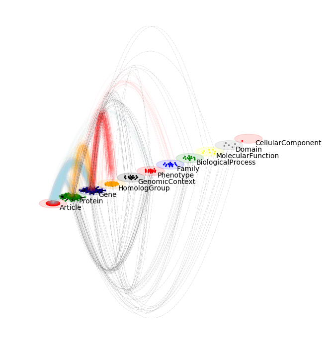

# *Py3Plex* - a library for analysis and visualization of heterogeneous networks

[](https://github.com/SkBlaz/py3plex/actions/workflows/tests.yml)

Heterogeneous networks are complex networks with additional information assigned to nodes or edges (or both). This library includes
some of the state-of-the-art algorithms for decomposition, visualization and analysis of such networks.


## Getting Started

### Installation

Install py3plex from GitHub:

```bash
pip install git+https://github.com/SkBlaz/py3plex.git
```

Or install from source for development:

```bash
git clone https://github.com/SkBlaz/py3plex.git
cd py3plex
pip install -e .
```

**Optional Dependencies**: Install additional features as needed:

```bash
# Advanced community detection with Infomap
pip install git+https://github.com/SkBlaz/py3plex.git#egg=py3plex[infomap]

# Additional algorithms (Louvain, cdlib)
pip install git+https://github.com/SkBlaz/py3plex.git#egg=py3plex[algos]

# Advanced visualization (plotly, igraph)
pip install git+https://github.com/SkBlaz/py3plex.git#egg=py3plex[viz]

# Install multiple extras
pip install git+https://github.com/SkBlaz/py3plex.git#egg=py3plex[infomap,viz]

# For development (includes testing and linting tools)
pip install -e ".[dev]"
```

### Quick Start

To get started, please view the **examples** folder.
Extensive documentation and quickstart tutorials are available at: [DOCS](https://skblaz.github.io/py3plex/)

### Development with Makefile

For a streamlined development experience, use the provided Makefile:

```bash
# View all available commands
make help

# Setup development environment (creates .venv and installs dependencies)
make setup

# Install package in editable mode with dev dependencies
make dev-install

# Auto-format code with isort, black, and ruff
make format

# Run linters and type checker
make lint

# Run tests with coverage
make test

# Open coverage report in browser
make coverage

# Build documentation
make docs

# Clean build artifacts and caches
make clean

# Build distribution packages
make build

# Publish to PyPI (requires TWINE_USERNAME and TWINE_PASSWORD)
make publish

# Verify API exports
make api-check

# Run CI checks (lint + test)
make ci
```

The Makefile provides colorized output and helpful error messages. All commands check for the virtual environment and provide clear instructions if setup is needed.

### Requirements

- Python 3.8 or higher
- NetworkX, NumPy, SciPy, and other dependencies (automatically installed)

### External Binaries (Optional)

**Note**: As of October 2025, py3plex no longer bundles external binaries (Infomap, Node2Vec) to reduce repository size and improve licensing clarity. If you need these tools:

**For Community Detection with Infomap**:
- Download from: https://www.mapequation.org/infomap/
- Or use the built-in Louvain algorithm (no binary needed)

**For Node2Vec Embeddings**:
- Use pure Python alternatives: `pip install node2vec` or `pip install pecanpy`
- Or download the C++ binary from: https://github.com/snap-stanford/snap

See `bin/README.md` for detailed installation instructions and alternatives.

For any errors, please open an issue!

### Testing

The simplest way to run tests:

```bash
python run_tests.py
```

For development with pytest:

```bash
# Install dev dependencies
pip install -e ".[dev]"

# Run all tests
pytest

# Run with coverage
pytest --cov=py3plex --cov-report=html
```

For comprehensive project context, development status, and guidance for maintainers and LLMs, see [LLM.md](./LLM.md).

### Contributions
If you are interested in contributing please:
- Either open a pull request
- Or write with your idea
- Or open an issue with your suggestion (feature requests welcome)

**Development Tools**:
The `pyproject.toml` includes configurations for:
- **Black**: Code formatting (`black py3plex/`)
- **Ruff**: Fast linting (`ruff check py3plex/ --fix`)
- **Mypy**: Type checking (`mypy py3plex/ --ignore-missing-imports`)
- **Pytest**: Testing with coverage
- **Pre-commit hooks**: Automated quality checks before commits

```bash
# Install dev dependencies
pip install -e ".[dev]"

# Setup pre-commit hooks (optional but recommended)
pre-commit install

# Run pre-commit manually on all files
pre-commit run --all-files
```


# Citations
```
@Article{Skrlj2019,
author={Skrlj, Blaz
and Kralj, Jan
and Lavrac, Nada},
title={Py3plex toolkit for visualization and analysis of multilayer networks},
journal={Applied Network Science},
year={2019},
volume={4},
number={1},
pages={94},
abstract={Complex networks are used as means for representing multimodal, real-life systems. With increasing amounts of data that lead to large multilayer networks consisting of different node and edge types, that can also be subject to temporal change, there is an increasing need for versatile visualization and analysis software. This work presents a lightweight Python library, Py3plex, which focuses on the visualization and analysis of multilayer networks. The library implements a set of simple graphical primitives supporting intra- as well as inter-layer visualization. It also supports many common operations on multilayer networks, such as aggregation, slicing, indexing, traversal, and more. The paper also focuses on how node embeddings can be used to speed up contemporary (multilayer) layout computation. The library's functionality is showcased on both real and synthetic networks.},
issn={2364-8228},
doi={10.1007/s41109-019-0203-7},
url={https://doi.org/10.1007/s41109-019-0203-7}
}


```
and
```
@InProceedings{10.1007/978-3-030-05411-3_60,
author="{\v{S}}krlj, Bla{\v{z}}
and Kralj, Jan
and Lavra{\v{c}}, Nada",
editor="Aiello, Luca Maria
and Cherifi, Chantal
and Cherifi, Hocine
and Lambiotte, Renaud
and Li{\'o}, Pietro
and Rocha, Luis M.",
title="Py3plex: A Library for Scalable Multilayer Network Analysis and Visualization",
booktitle="Complex Networks and Their Applications VII",
year="2019",
publisher="Springer International Publishing",
address="Cham",
pages="757--768",
abstract="Real-life systems are commonly represented as networks of interacting entities. While homogeneous networks consist of nodes of a single node type, multilayer networks are characterized by multiple types of nodes or edges, all present in the same system. Analysis and visualization of such networks represent a challenge for real-life complex network applications. The presented Py3plex Python-based library facilitates the exploration and visualization of multilayer networks. The library includes a diagonal projection-based network visualization, developed specifically for large networks with multiple node (and edge) types. The library also includes state-of-the-art methods for network decomposition and statistical analysis. The Py3plex functionality is showcased on real-world multilayer networks from the domains of biology and on synthetic networks.",
isbn="978-3-030-05411-3"
}

```
