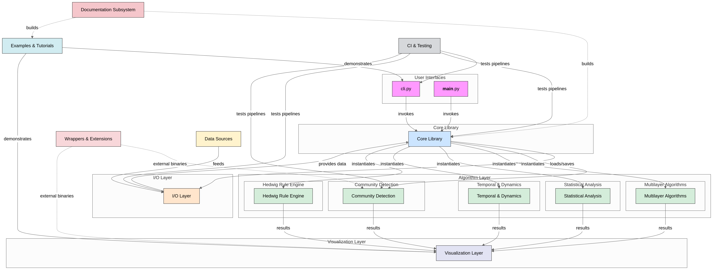

# *Py3Plex* - a library for analysis and visualization of multilayer networks


[](https://github.com/SkBlaz/py3plex/actions/workflows/tests.yml)
[](https://github.com/SkBlaz/py3plex/actions/workflows/examples.yml)
[](https://github.com/SkBlaz/py3plex/actions/workflows/tutorial-validation.yml)
[](https://github.com/SkBlaz/py3plex/actions/workflows/code-quality.yml)
[](https://github.com/SkBlaz/py3plex/actions/workflows/benchmarks.yml)
[](https://github.com/SkBlaz/py3plex/actions/workflows/doc-coverage.yml)
[](https://github.com/SkBlaz/py3plex/actions/workflows/verify.yml)
[](https://github.com/SkBlaz/py3plex/actions/workflows/fuzzing.yml)


*Multilayer networks* are complex networks with additional information assigned to nodes or edges (or both). This library includes
some of the state-of-the-art algorithms for decomposition, visualization and analysis of such networks.

## Getting Started

### Installation (Git-Only Method)

WARNING: **IMPORTANT**: py3plex is **no longer updated on PyPI**. Install from GitHub:

```bash
pip install git+https://github.com/SkBlaz/py3plex.git
```

and

```bash
py3plex selftest
```
To verify installation.


**Note**: The Git version includes the latest features and bug fixes. PyPI version is deprecated.

**Recommended**: Use a virtual environment (venv or conda) to manage dependencies.

**Documentation:** Complete documentation is available at [https://skblaz.github.io/py3plex/](https://skblaz.github.io/py3plex/)

* [Examples](examples/) - 50+ example scripts demonstrating usage ([see examples README](examples/README.md))

**Repo organization:**

*made with http://gitdiagram.com*
### CLI Tool

Py3plex includes a powerful command-line interface for multilayer network analysis.

**Common CLI Commands:**
- `py3plex quickstart` - Interactive demo with example graph (recommended for new users)
- `py3plex selftest` - Verify installation and core functionality
- `py3plex --version` - Show version information
- `py3plex --help` - Show all available commands and options

See the [CLI Tutorial](https://skblaz.github.io/py3plex/tutorials/cli_usage.html) for complete documentation.

### Web GUI

Py3plex includes a production-ready web-based GUI for multilayer network analysis, visualization, and exploration.

**Features:**
-  **Interactive Web Interface** - React-based UI with real-time updates
- * **Network Visualization** - Layer-centric views with configurable layouts
- * **Advanced Analysis** - Centrality metrics, community detection, and more
- * **Multiple Formats** - Support for edgelist, GML, NetworkX pickle files
- * **Async Processing** - Background job execution with progress tracking
-  **Workspace Management** - Save and restore complete analysis sessions

**Quick Start:**
```bash
cd gui
cp .env.example .env
make up

# Open in browser: http://localhost:8080
```

**Architecture:**
- Frontend: React + TypeScript + Vite
- Backend: FastAPI with py3plex integration
- Workers: Celery for async analysis jobs
- Monitoring: Flower dashboard at http://localhost:5555

**Requirements:**
- Docker & Docker Compose (>= 2.0)
- 4GB RAM minimum
- Ports: 8080 (GUI), 5555 (Flower), 8000 (API), 6379 (Redis)

**Documentation:** See the [GUI Documentation](https://skblaz.github.io/py3plex/gui.html) for complete setup, API reference, and deployment guide.

### Requirements

- Python 3.8 or higher
- NetworkX, NumPy, SciPy, and other dependencies (automatically installed)

### R Integration (via reticulate)

Py3plex provides seamless integration with R through the **reticulate** package, enabling R users (especially those familiar with igraph or MLnet) to leverage py3plex's multilayer network capabilities.

**Key Features:**
- Convert py3plex networks to igraph format (compatible with R's igraph package)
- Export graph data as R data frames for analysis
- Access comprehensive network statistics
- Support for both directed and undirected multilayer networks

**Quick Start (R):**
```R
library(reticulate)
library(igraph)

# Import py3plex
py3plex <- import("py3plex")
r_interop <- import("py3plex.wrappers.r_interop")

# Create a multilayer network
net <- py3plex$multi_layer_network()
net$add_nodes(list(list(source='A'), list(source='B')))
net$add_edges(list(list(source='A', target='B')))

# Convert to igraph for R analysis
g <- r_interop$to_igraph_for_r(net, mode='union')

# Use R's igraph functions
degree(g)
plot(g)
```

**Available R Interop Functions:**
- `to_igraph_for_r()` - Convert to igraph (optimized for R usage)
- `export_edgelist()` - Export edges as R-friendly data structure
- `export_nodelist()` - Export nodes as R-friendly data structure
- `export_graph_data()` - Export complete graph data
- `export_adjacency()` - Export adjacency matrix
- `get_network_stats()` - Get network statistics

**See:** [R Interop Example](examples/r_interop_example.py) for complete usage demonstrations.

**Installation for R users:**
```bash
# Install py3plex with igraph support
pip install git+https://github.com/SkBlaz/py3plex.git
pip install python-igraph
```

### External Binaries (Optional)

**Note**: As of October 2025, py3plex no longer bundles external binaries (Infomap, Node2Vec) to reduce repository size and improve licensing clarity. If you need these tools:

**For Community Detection with Infomap**:
- Download from: https://www.mapequation.org/infomap/
- Or use the built-in Louvain algorithm (no binary needed)

**For Node2Vec Embeddings**:
- Use pure Python alternatives: `pip install node2vec` or `pip install pecanpy`
- Or download the C++ binary from: https://github.com/snap-stanford/snap

### License Compatibility

**Main Library**: py3plex is distributed under the **MIT License** (permissive, commercial-friendly).

**Bundled Code Considerations**: The repository contains AGPLv3-licensed code in `py3plex/algorithms/community_detection/infomap/`. If you use Infomap-based community detection functions, your application may be subject to AGPLv3 requirements (copyleft).

**License Matrix**:

| Feature Category | License | Commercial Use | Notes |
|-----------------|---------|----------------|-------|
| Core multilayer network functionality | MIT | Yes Yes | Safe for proprietary use |
| Network visualization (layouts, colors) | MIT | Yes Yes | Safe for proprietary use |
| I/O operations (load/save networks) | MIT | Yes Yes | Safe for proprietary use |
| Louvain community detection | BSD-3-Clause | Yes Yes | Safe for proprietary use |
| Label propagation algorithms | MIT | Yes Yes | Safe for proprietary use |
| **Infomap community detection** | **AGPLv3** | WARNING: Restricted | Viral license - requires open-sourcing derived works |
| Node embeddings (if using bundled code) | Varies | WARNING: Check | Use pure Python alternatives for safety |

**Recommendations**:
- **For commercial/proprietary projects**: Avoid Infomap functions or use the pure Python `infomap` package separately
- **For open-source projects**: All features are safe to use
- **When in doubt**: Use alternative algorithms (Louvain, label propagation) which are BSD/MIT licensed

For any errors, please open an issue!

### Testing

**Quick start** - Run all tests, benchmarks, and linting (single entrypoint that ensures all CI passes):
```bash
make test-all
```

**Individual commands:**
```bash
make test       # Run tests only
make benchmark  # Run benchmarks only
make lint       # Run linters only
```

**Legacy method:**
```bash
python run_tests.py
```

### Performance Benchmarks

Py3plex includes performance benchmark tests to track and ensure the runtime efficiency of core multilayer data structures. These benchmarks measure operations like network creation, node/edge traversal, layer operations, and network transformations.

**Run all benchmarks via Makefile:**
```bash
make benchmark
```

**Or run directly with pytest:**
```bash
pytest tests/test_performance_core.py --benchmark-only -v
pytest benchmarks/ --benchmark-only -v
```

**Run specific benchmark categories:**
```bash
# Network creation benchmarks
pytest tests/test_performance_core.py::TestNetworkCreationBenchmarks --benchmark-only -v

# Node/edge operation benchmarks
pytest tests/test_performance_core.py::TestNodeEdgeOperationsBenchmarks --benchmark-only -v

# Scaling tests
pytest tests/test_performance_core.py::TestScalabilityBenchmarks -v
```

**Generate JSON report:**
```bash
pytest tests/test_performance_core.py --benchmark-only --benchmark-json=benchmark-results.json
```

Benchmark results are automatically collected in CI and made available as workflow artifacts. The benchmark badge above shows the current status of performance tests.

### Contributions

We welcome contributions! See the [online documentation](https://skblaz.github.io/py3plex/) for development guidelines, testing procedures, and code quality standards.

## Building Documentation

Py3plex uses Sphinx to generate comprehensive documentation in both HTML and PDF formats.

### Building HTML Documentation

```bash
make docs
# Output: docfiles/_build/html/index.html
```

Or directly with Sphinx:
```bash
cd docfiles
sphinx-build -b html . _build/html
```

### Generating PDF Documentation

The documentation can be exported as a PDF file for offline reading and distribution.

**Using Make:**
```bash
make docs-pdf
# Output: docs/py3plex_documentation.pdf
```

**Using the standalone script:**
```bash
cd docfiles
./generate_pdf.sh
# Output: ../docs/py3plex_documentation.pdf
```

**Requirements:**
- Sphinx and extensions: `pip install sphinx sphinx-rtd-theme`
- LaTeX distribution (Ubuntu/Debian): `sudo apt-get install texlive-latex-base texlive-latex-extra latexmk`
- LaTeX distribution (macOS): `brew install --cask mactex`

The PDF is automatically generated and committed by the GitHub Actions workflow on pushes to the main branch.

**Download the latest PDF:** [py3plex_documentation.pdf](docs/py3plex_documentation.pdf)

# Citations
```
@Article{Skrlj2019,
author={Skrlj, Blaz
and Kralj, Jan
and Lavrac, Nada},
title={Py3plex toolkit for visualization and analysis of multilayer networks},
journal={Applied Network Science},
year={2019},
volume={4},
number={1},
pages={94},
abstract={Complex networks are used as means for representing multimodal, real-life systems. With increasing amounts of data that lead to large multilayer networks consisting of different node and edge types, that can also be subject to temporal change, there is an increasing need for versatile visualization and analysis software. This work presents a lightweight Python library, Py3plex, which focuses on the visualization and analysis of multilayer networks. The library implements a set of simple graphical primitives supporting intra- as well as inter-layer visualization. It also supports many common operations on multilayer networks, such as aggregation, slicing, indexing, traversal, and more. The paper also focuses on how node embeddings can be used to speed up contemporary (multilayer) layout computation. The library's functionality is showcased on both real and synthetic networks.},
issn={2364-8228},
doi={10.1007/s41109-019-0203-7},
url={https://doi.org/10.1007/s41109-019-0203-7}
}
```
and
```
@InProceedings{10.1007/978-3-030-05411-3_60,
author="{\v{S}}krlj, Bla{\v{z}}
and Kralj, Jan
and Lavra{\v{c}}, Nada",
editor="Aiello, Luca Maria
and Cherifi, Chantal
and Cherifi, Hocine
and Lambiotte, Renaud
and Li{\'o}, Pietro
and Rocha, Luis M.",
title="Py3plex: A Library for Scalable Multilayer Network Analysis and Visualization",
booktitle="Complex Networks and Their Applications VII",
year="2019",
publisher="Springer International Publishing",
address="Cham",
pages="757--768",
abstract="Real-life systems are commonly represented as networks of interacting entities. While homogeneous networks consist of nodes of a single node type, multilayer networks are characterized by multiple types of nodes or edges, all present in the same system. Analysis and visualization of such networks represent a challenge for real-life complex network applications. The presented Py3plex Python-based library facilitates the exploration and visualization of multilayer networks. The library includes a diagonal projection-based network visualization, developed specifically for large networks with multiple node (and edge) types. The library also includes state-of-the-art methods for network decomposition and statistical analysis. The Py3plex functionality is showcased on real-world multilayer networks from the domains of biology and on synthetic networks.",
isbn="978-3-030-05411-3"
}
```
