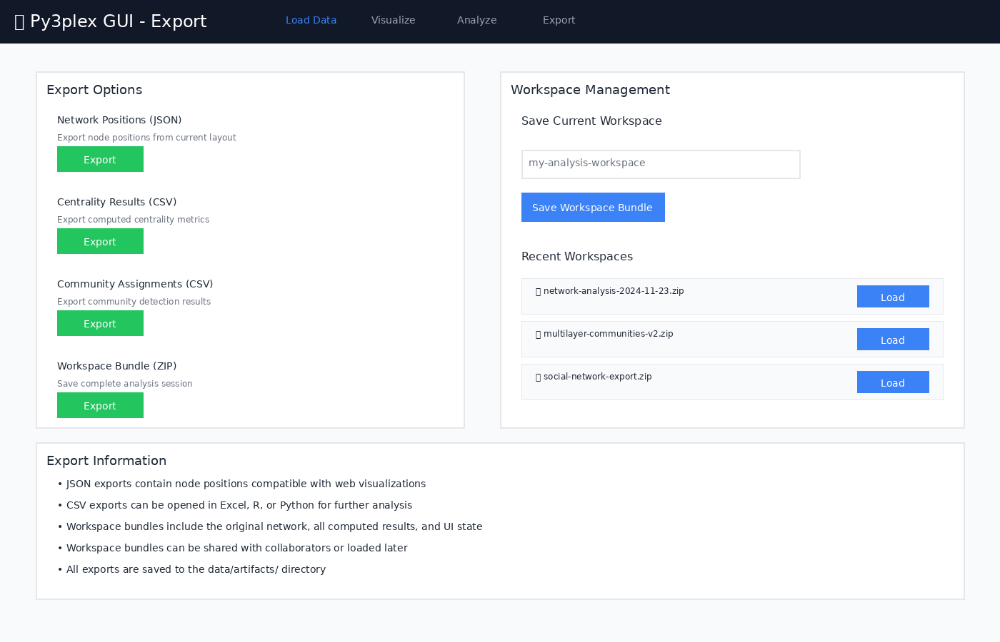

********************
Py3plex GUI
********************

A production-ready web-based GUI for **py3plex** multilayer network analysis, running locally via Docker Compose. Upload multilayer graphs, explore them visually, and run common analytics from your browser.

.. image:: https://img.shields.io/badge/license-BSD--3--Clause-blue
   :alt: License

.. image:: https://img.shields.io/badge/docker-compose-blue
   :alt: Docker

Visual Overview
===============

The Py3plex GUI provides an intuitive web interface for multilayer network analysis. Below are screenshots of the main interface pages:

.. image:: ../../example_images/gui_load_data.png
   :width: 800px
   :alt: Load Data Page
   :align: center

*Figure 1: Load Data page for uploading network files in various formats*

|

Prerequisites
=============

- Docker (>= 20.10)
- Docker Compose (>= 2.0)
- 4GB RAM minimum
- Ports available: 8080 (GUI), 5555 (Flower), 8000 (API), 6379 (Redis)

Quickstart
===========

Use this sequence after the prerequisites above are installed and ports are free:

.. code-block:: bash

    # Navigate to the gui directory
    cd gui

    # Copy environment configuration
    cp .env.example .env

    # Start all services (builds automatically)
    make up

    # Open in browser
    #  Application: http://localhost:8080
    # Data Job Monitor (Flower): http://localhost:5555

**First time?** The build takes ~3-5 minutes. Subsequent starts are instant.
Wait for containers to report ``healthy`` before using the UI.

That's it! The application will be running with:

- React + TypeScript frontend with hot reload
- FastAPI backend with py3plex integration
- Celery workers for async jobs
- Redis broker
- Nginx reverse proxy

Architecture
============

::

    ┌─────────────────────────────────────────────────────────────┐
    │                     Nginx (Port 8080)                        │
    │  Reverse Proxy + Static Serving                             │
    └───────┬────────────────────────┬────────────────────────────┘
            │                        │
            ▼                        ▼
    ┌──────────────┐         ┌──────────────────────┐
    │   Frontend   │         │      FastAPI         │
    │ React + Vite │         │  (Port 8000)         │
    │   (Dev HMR)  │         │  py3plex wrapper     │
    └──────────────┘         └──────────┬───────────┘
                                        │
                        ┌───────────────┴────────────────┐
                        ▼                                ▼
                ┌──────────────┐                ┌──────────────┐
                │    Redis     │                │    Celery    │
                │  (Port 6379) │◄──────────────│    Worker    │
                │    Broker    │                │  + Flower    │
                └──────────────┘                └──────────────┘
                        │
                        ▼
                ┌──────────────────────────────────┐
                │  Shared Volume: /data            │
                │  - uploads/                      │
                │  - artifacts/                    │
                │  - workspaces/                   │
                └──────────────────────────────────┘

**Key Components:**

- **Frontend**: React 18 + Vite + TypeScript + Tailwind CSS
- **API**: FastAPI (Python 3.12) with py3plex integration
- **Worker**: Celery for long-running analysis jobs
- **Broker**: Redis for job queue
- **Proxy**: Nginx for unified access
- **Monitoring**: Flower dashboard for job inspection

Features
========

Data Loading
------------

- Upload network files (.edgelist, .txt, .gml, .gpickle)
- Automatic format detection
- Multilayer network support
- Real-time file preview

Visualization
-------------

.. image:: ../../example_images/gui_visualize.png
   :width: 800px
   :alt: Visualization Page
   :align: center

*Figure 2: Network visualization with layer controls and node inspection panel*

|

**Features:**

- Layer-centric view
- Interactive node/edge inspection
- Configurable layouts
- Position caching

Analysis (Async via Celery)
---------------------------

.. image:: ../../example_images/gui_analyze.png
   :width: 800px
   :alt: Analysis Page
   :align: center

*Figure 3: Analysis page with job controls and real-time progress tracking*

|

**Available Analysis Tools:**

- **Layouts**: Spring, Kamada-Kawai, Circular, Random
- **Centrality**: Degree, Betweenness, Closeness, Eigenvector, PageRank
- **Community Detection**: Louvain, Label Propagation, Greedy Modularity
- Real-time progress tracking
- Result caching

Export
------

*Figure 4: Export page for saving analysis results and workspace bundles*

|

**Export Options:**

- CSV summaries (centrality, communities)
- JSON position data
- PNG snapshots (planned)
- Workspace bundles (data + state + results)

Workspace Bundles
-----------------

Save and restore complete analysis sessions. A bundle includes:

- Original network file
- Computed layouts
- Centrality results
- Community assignments
- UI view state

Export a bundle from the **Export** page and re-import it later to restore the exact session state.

Job Monitoring
--------------

The GUI includes Flower dashboard for real-time monitoring of background jobs:

.. image:: ../../example_images/gui_flower_dashboard.png
   :width: 800px
   :alt: Flower Dashboard
   :align: center

*Figure 5: Flower dashboard showing task history and worker status*

|

**Monitoring Features:**

- Track task execution in real-time
- View worker status and performance
- Inspect task history and results
- Monitor task queue and completion rates
- Access at http://localhost:5555 when running

Development Guide
=================

Project Structure
-----------------

::

    gui/
    ├── docker-compose.yml          # Main orchestration
    ├── compose.gpu.yml             # GPU override (optional)
    ├── Makefile                    # Convenience commands
    ├── .env.example                # Configuration template
    ├── nginx/
    │   └── nginx.conf              # Reverse proxy config
    ├── api/
    │   ├── Dockerfile.api          # API container
    │   ├── pyproject.toml          # Python dependencies
    │   └── app/
    │       ├── main.py             # FastAPI app
    │       ├── schemas.py          # Pydantic models
    │       ├── deps.py             # DI & config
    │       ├── routes/             # API endpoints
    │       ├── services/           # Business logic (py3plex wrappers)
    │       ├── workers/            # Celery tasks
    │       └── utils/              # Helpers
    ├── worker/
    │   └── Dockerfile              # Worker container
    ├── frontend/
    │   ├── Dockerfile.frontend     # Frontend container
    │   ├── package.json            # Node dependencies
    │   ├── vite.config.ts          # Vite config
    │   └── src/
    │       ├── App.tsx             # Root component
    │       ├── lib/api.ts          # API client
    │       ├── pages/              # Page components
    │       └── components/         # Reusable components
    └── data/                       # Shared volume (gitignored)
        ├── uploads/
        ├── artifacts/
        └── workspaces/

Makefile Commands
-----------------

.. code-block:: bash

    make setup          # Copy .env.example to .env
    make up             # Start all services (build if needed)
    make down           # Stop and remove containers + volumes
    make restart        # Restart all services
    make build          # Rebuild Docker images
    make logs           # Tail logs from all services

    # Development helpers
    make bash-api       # Shell into API container
    make bash-worker    # Shell into worker container
    make bash-frontend  # Shell into frontend container

    # Testing
    make test-api       # Run API tests
    make e2e            # Run end-to-end tests (WIP)

    # Cleanup
    make clean          # Remove containers, volumes, and data

Local Development Against py3plex
----------------------------------

The py3plex repository root is bind-mounted read-only into containers at ``/workspace``:

.. code-block:: dockerfile

    # In Dockerfile.api
    ARG PY3PLEX_PATH=/workspace
    RUN pip install -e ${PY3PLEX_PATH}

**Benefits:**

- Changes to py3plex core reflect immediately (no rebuild)
- Editable install for development
- Isolated GUI code under ``gui/``

**Note:** The mount is read-only to prevent accidental writes from containers.

Configuration
=============

Environment Variables (.env)
----------------------------

.. code-block:: bash

    # API
    API_WORKERS=2              # Uvicorn workers
    MAX_UPLOAD_MB=512          # Max file size

    # Celery
    CELERY_CONCURRENCY=2       # Worker threads
    REDIS_URL=redis://redis:6379/0

    # Frontend
    VITE_API_URL=http://localhost:8080/api

GPU Support (Optional)
----------------------

Enable NVIDIA GPU acceleration:

.. code-block:: bash

    docker compose -f docker-compose.yml -f compose.gpu.yml up

**Requirements:**

- NVIDIA Docker runtime installed
- CUDA-compatible GPU

Data Formats
============

Accepted Input Formats
----------------------

**1. Edge List (.edgelist, .txt)**

::

    # Multilayer format: node1 node2 layer weight
    1 2 social 1.0
    1 3 work 1.0
    2 3 hobby 0.5

    # Simple format: node1 node2
    A B
    B C
    C D

Use whitespace-separated columns. Include the layer column for multilayer graphs; omit it for single-layer files. Weights are optional and default to 1.0 if absent.

**2. GML (.gml)**

- Graph Modeling Language
- Preserves attributes and metadata

**3. NetworkX Pickle (.gpickle)**

- Native NetworkX serialization
- Fastest for large graphs

Example Dataset
---------------

Try the included toy network (6 nodes, 14 edges, 3 layers):

.. code-block:: bash

    # From host
    curl -F "file=@gui/toy_network.edgelist" http://localhost:8080/api/upload

    # Or use the Web UI at http://localhost:8080

Testing
=======

Continuous Integration
----------------------

GUI tests run automatically on GitHub Actions for any changes to the ``gui/`` directory. Pushes and pull requests that touch GUI files trigger the workflow:

.. code-block:: yaml

    # Workflow: .github/workflows/gui-tests.yml
    - API unit tests (pytest)
    - Integration tests (Docker Compose)
    - Frontend build verification

**Status**:

.. image:: https://github.com/SkBlaz/py3plex/actions/workflows/gui-tests.yml/badge.svg
   :target: https://github.com/SkBlaz/py3plex/actions/workflows/gui-tests.yml
   :alt: GUI Tests

Tests include:

- Health endpoint validation
- File upload with toy network
- Layout job execution and completion
- Centrality computation
- Service health checks

API Tests
---------

.. code-block:: bash

    # Run inside API container
    make bash-api
    pytest ci/api-tests/ -v

    # Or directly
    docker compose exec api pytest ci/api-tests/ -v

Integration Tests
-----------------

The CI workflow runs full integration tests (Docker Compose brings up the full stack and exercises uploads + analysis):

.. code-block:: bash

    # With the stack running (`make up`):
    cd gui
    # Upload the sample network
    curl -F "file=@toy_network.edgelist" http://localhost:8080/api/upload
    # Kick off layout, centrality, and community detection jobs
    # Verify each job reaches status=completed and returns results

Frontend Tests (WIP)
--------------------

.. code-block:: bash

    # Playwright smoke tests
    make e2e

Manual Testing Workflow
-----------------------

For a step-by-step manual checklist, see ``docfiles/gui/gui_testing.rst``. Quick smoke flow:

1. **Upload** ``toy_network.edgelist`` via Web UI
2. **Visualize** the network (expect 6 nodes, 14 edges, 3 layers)
3. **Analyze**:
   
   - Run Spring Layout
   - Compute Centrality (degree + betweenness)
   - Detect Communities (Louvain)

4. **Monitor** jobs at http://localhost:5555 (Flower) and confirm they transition to ``completed`` without errors
5. **Export** workspace bundle

Production Deployment
=====================

Static Build (Recommended)
--------------------------

For production, serve pre-built frontend assets instead of the Vite dev server:

.. code-block:: dockerfile

    # Modify Dockerfile.frontend to use multi-stage build
    FROM node:20-alpine AS builder
    WORKDIR /app
    COPY frontend/ .
    RUN npm install && npm run build

    FROM nginx:alpine
    COPY --from=builder /app/dist /usr/share/nginx/html
    COPY nginx/nginx.conf /etc/nginx/nginx.conf

Update ``docker-compose.yml``:

.. code-block:: yaml

    frontend:
      build:
        context: .
        dockerfile: Dockerfile.frontend.prod
      # Remove dev server volume mounts

Security Considerations
-----------------------

- Set ``CORS allow_origins`` to specific domains (not ``*``)
- Add authentication/authorization middleware
- Use HTTPS (add TLS termination in Nginx)
- Validate file uploads strictly
- Set resource limits per user/job
- Enable Celery task rate limiting

**Current Status**: Development mode - suitable for local use only. Do not expose to the public internet without proper security hardening.

Troubleshooting
===============

Issue: Port already in use
--------------------------

.. code-block:: bash

    # Find process using port 8080
    lsof -ti:8080 | xargs -r kill

    # Or change port in docker-compose.yml
    ports:
      - "8081:80"  # Use 8081 instead

Issue: Permission denied on /data
----------------------------------

.. code-block:: bash

    # Fix volume permissions
    sudo chown -R $(whoami):$(whoami) gui/data/

Issue: py3plex import error in containers
------------------------------------------

.. code-block:: bash

    # Verify mount
    docker compose exec api ls -la /workspace

    # Reinstall if needed
    docker compose exec api pip install -e /workspace

Issue: Frontend can't reach API
--------------------------------

Check Nginx proxy config:

.. code-block:: bash

    docker compose exec nginx cat /etc/nginx/nginx.conf

    # Test API directly
    curl http://localhost:8000/api/health

API Documentation
=================

Interactive docs available at:

- **Swagger UI**: http://localhost:8080/api/docs
- **ReDoc**: http://localhost:8080/api/redoc

Key Endpoints
-------------

::

    POST   /api/upload                          # Upload network file
    GET    /api/graphs/{id}/summary             # Graph statistics
    POST   /api/graphs/{id}/layout              # Compute layout (async)
    POST   /api/graphs/{id}/analysis/centrality # Compute centrality (async)
    POST   /api/graphs/{id}/analysis/community  # Detect communities (async)
    GET    /api/jobs/{id}                       # Poll job status
    POST   /api/workspaces/save                 # Save workspace bundle

Example: Run Analysis
---------------------

.. code-block:: bash

    # 1. Upload
    GRAPH_ID=$(curl -F "file=@toy_network.edgelist" \
      http://localhost:8080/api/upload | jq -r .graph_id)

    # 2. Start layout job
    JOB_ID=$(curl -X POST \
      -H "Content-Type: application/json" \
      -d '{"algorithm":"spring","seed":42,"dimensions":2}' \
      http://localhost:8080/api/graphs/$GRAPH_ID/layout | jq -r .job_id)

    # 3. Poll job
    curl http://localhost:8080/api/jobs/$JOB_ID

    # 4. Get positions
    curl http://localhost:8080/api/graphs/$GRAPH_ID/positions

Contributing
============

This GUI is part of the `py3plex <https://github.com/SkBlaz/py3plex>`_ project.

**Guidelines:**

- Keep all GUI code under ``gui/``
- Do not modify py3plex core
- Follow existing code style (Black, Ruff for Python; ESLint for TypeScript)
- Add tests for new features
- Update documentation with new features

License
=======

This GUI follows the py3plex repository license:

- **GUI code** (under ``gui/``): BSD-3-Clause (same as py3plex)
- **Dependencies**: See individual package licenses

Acknowledgments
===============

Built with:

- `py3plex <https://github.com/SkBlaz/py3plex>`_ - Multilayer network analysis
- `FastAPI <https://fastapi.tiangolo.com/>`_ - Modern Python web framework
- `Celery <https://docs.celeryproject.org/>`_ - Distributed task queue
- `React <https://react.dev/>`_ - UI library
- `Vite <https://vitejs.dev/>`_ - Frontend build tool
- `Tailwind CSS <https://tailwindcss.com/>`_ - Utility-first CSS

Support
=======

- **Issues**: https://github.com/SkBlaz/py3plex/issues
- **Docs**: https://skblaz.github.io/py3plex/
- **py3plex Paper**: `Applied Network Science 2019 <https://doi.org/10.1007/s41109-019-0203-7>`_
