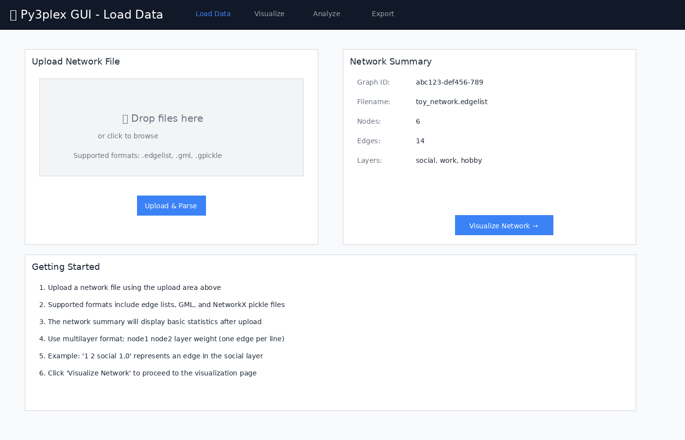
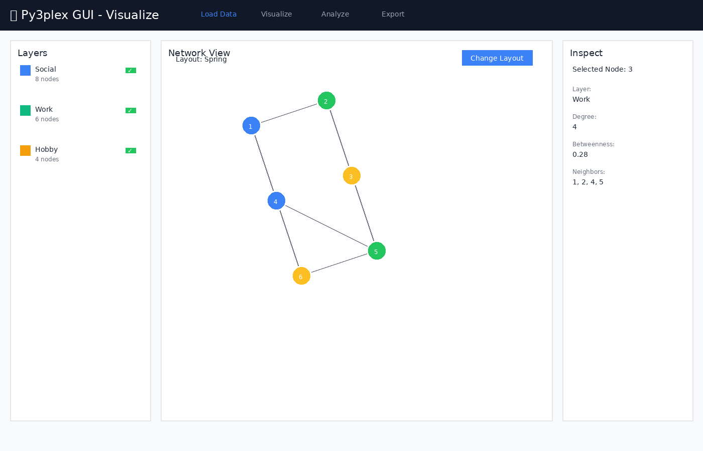
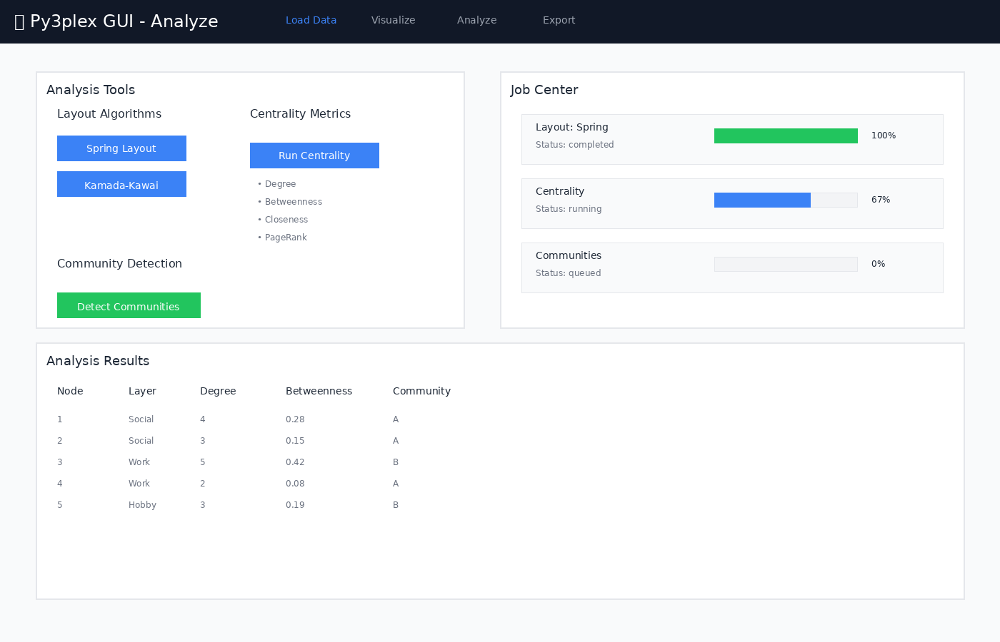
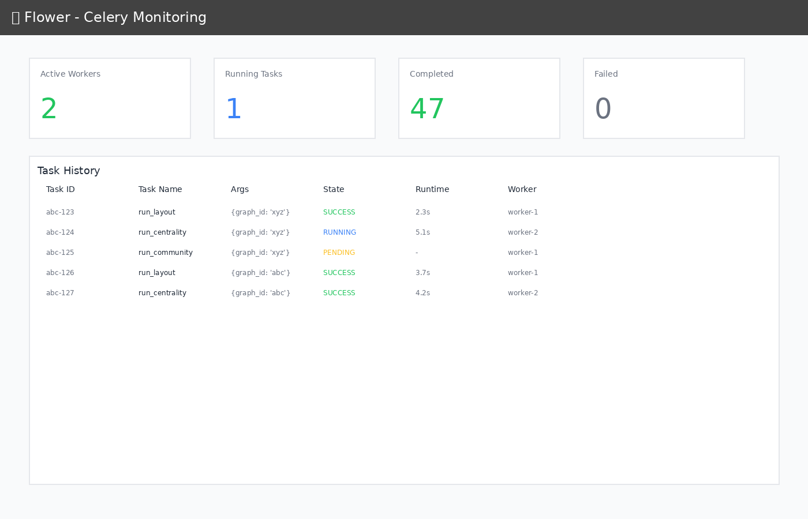

**********************
GUI Testing Guide
**********************

Complete testing guide for the Py3plex GUI, including automated CI tests and manual validation.

Visual Interface Preview
========================

The Py3plex GUI consists of several key pages that work together for network analysis:

*Load Data Page - Upload and parse network files*

|

*Visualize Page - Interactive network view with layer controls*

|

*Analyze Page - Run jobs and monitor progress*

|

Automated Testing (CI)
======================

GitHub Actions Workflow
-----------------------

All GUI tests run automatically on GitHub Actions:

**Workflow**: ``.github/workflows/gui-tests.yml``

**Triggers**:

- Push to main/master/develop branches (if ``gui/`` files changed)
- Pull requests targeting main/master/develop (if ``gui/`` files changed)
- Manual workflow dispatch

**Test Jobs**:

1. **API Tests** (~5 min)
   
   - Build API, worker, redis containers
   - Run pytest suite: ``ci/api-tests/``
   - Validate health endpoint
   - Test file upload functionality

2. **Integration Tests** (~10 min)
   
   - Build all services (including nginx, frontend)
   - Test full upload → analyze → export flow
   - Validate layout job execution
   - Test centrality computation
   - Verify service health

3. **Frontend Build** (~5 min)
   
   - Type check TypeScript
   - Build production bundle
   - Verify dist output

**View Results**: Check the Actions tab on GitHub or the badge in README.md

Running CI Tests Locally
------------------------

You can run the same tests locally:

.. code-block:: bash

    cd gui

    # API tests
    docker compose build api worker redis
    docker compose up -d api worker redis
    docker compose exec api pytest ci/api-tests/ -v
    docker compose down -v

    # Integration tests
    docker compose up -d --build
    # Wait for services
    curl -f http://localhost:8080/api/health
    # Run manual integration tests (see below)
    docker compose down -v

    # Frontend build
    cd frontend
    npm ci
    npm run build

Manual Testing Guide
====================

Manual testing guide for the Py3plex GUI. Follow these steps to validate the implementation.

Prerequisites
-------------

- Docker and Docker Compose installed
- At least 4GB RAM available
- Ports 8080, 5555, 8000, 6379 available

Setup
-----

.. code-block:: bash

    cd gui
    cp .env.example .env
    make up

**Expected**: All containers start successfully. Check with ``docker compose ps``.

Test 1: Health Check
--------------------

API Health
^^^^^^^^^^

.. code-block:: bash

    curl http://localhost:8080/api/health

**Expected Response**:

.. code-block:: json

    {"status":"ok","version":"0.1.0"}

Frontend Access
^^^^^^^^^^^^^^^

Open browser to ``http://localhost:8080``

**Expected**: React app loads with navigation bar showing:

- Load Data
- Visualize
- Analyze
- Export

Flower Dashboard
^^^^^^^^^^^^^^^^

Open browser to ``http://localhost:5555``

**Expected**: Celery Flower dashboard loads showing workers.

*Flower monitoring dashboard showing task history and worker status*

|

Test 2: Upload Network
----------------------

1. Navigate to **Load Data** page
2. Click "Click to upload" or drag and drop ``toy_network.edgelist``
3. Click "Upload & Parse"

**Expected**:

- Upload progress indicator appears
- Network Summary displays:
  
  - Graph ID (UUID)
  - Filename: ``toy_network.edgelist``
  - Nodes: 6
  - Edges: 14
  - Layers: hobby, social, work

Test 3: Visualize Network
--------------------------

1. Click "Visualize Network →" or navigate to **Visualize** page

**Expected**:

- Page shows three panels: Layers, Network View, Inspect
- Network View shows placeholder with "Graph with X nodes"
- No errors in console

Test 4: Run Layout Job
----------------------

1. Navigate to **Analyze** page
2. Click "Run Spring Layout" button

**Expected**:

- Job appears in Job Center below
- Status shows "queued" → "running" → "completed"
- Progress updates (10% → 30% → 80% → 100%)
- Job shows green checkmark when complete

Verify in Flower
^^^^^^^^^^^^^^^^

1. Open ``http://localhost:5555``
2. Check "Tasks" tab

**Expected**: Layout task appears with status SUCCESS

Test 5: Run Centrality Analysis
--------------------------------

1. On **Analyze** page, click "Run Centrality" button

**Expected**:

- New job appears in Job Center
- Type: "Centrality"
- Status progresses to "completed"
- No errors

Test 6: Run Community Detection
--------------------------------

1. On **Analyze** page, click "Detect Communities" button

**Expected**:

- New job appears in Job Center
- Type: "Community Detection"
- Status progresses to "completed"
- Result includes number of communities found

Test 7: Export Workspace
-------------------------

1. Navigate to **Export** page
2. Enter workspace name: "test-workspace"
3. Click "Save Workspace Bundle"

**Expected**:

- Success message: "Workspace saved as test-workspace_{uuid}.zip"
- Workspace ID displayed

Verify File Created
^^^^^^^^^^^^^^^^^^^

.. code-block:: bash

    ls -lh gui/data/workspaces/

**Expected**: Zip file exists with recent timestamp

Test 8: API Direct Testing
---------------------------

Upload via API
^^^^^^^^^^^^^^

.. code-block:: bash

    curl -F "file=@toy_network.edgelist" \
      http://localhost:8080/api/upload

**Expected**: JSON response with ``graph_id``

Get Graph Summary
^^^^^^^^^^^^^^^^^

.. code-block:: bash

    GRAPH_ID=<from_previous_step>
    curl http://localhost:8080/api/graphs/$GRAPH_ID/summary

**Expected**: JSON with nodes, edges, layers

Start Layout Job
^^^^^^^^^^^^^^^^

.. code-block:: bash

    curl -X POST \
      -H "Content-Type: application/json" \
      -d '{"algorithm":"spring","seed":42,"dimensions":2}' \
      http://localhost:8080/api/graphs/$GRAPH_ID/layout

**Expected**: JSON response with ``job_id``

Check Job Status
^^^^^^^^^^^^^^^^

.. code-block:: bash

    JOB_ID=<from_previous_step>
    curl http://localhost:8080/api/jobs/$JOB_ID

**Expected**: JSON with status, progress, result

Test 9: Logs Inspection
-----------------------

.. code-block:: bash

    # View all logs
    make logs

    # Or individual services
    docker compose logs api
    docker compose logs worker
    docker compose logs frontend

**Expected**: No error messages, only INFO level logs

Test 10: Container Health
--------------------------

.. code-block:: bash

    docker compose ps

**Expected**: All services show "healthy" or "running"

Test 11: Data Persistence
--------------------------

1. Upload a network
2. Run a layout job
3. Stop containers: ``make down``
4. Restart: ``make up``
5. Upload same network again

**Expected**: 

- Uploads work after restart
- Previous artifacts still in ``gui/data/``

Test 12: Multiple Jobs
----------------------

1. Navigate to **Analyze** page
2. Quickly click:
   
   - Run Spring Layout
   - Run Centrality
   - Detect Communities

**Expected**:

- All three jobs appear in Job Center
- Jobs process in parallel (check Flower)
- All complete successfully

Common Issues
=============

Port Already in Use
-------------------

.. code-block:: bash

    # Find and kill process
    lsof -ti:8080 | xargs kill -9

    # Or change port in docker-compose.yml
    ports:
      - "8081:80"

Container Won't Start
---------------------

.. code-block:: bash

    # Check logs
    docker compose logs <service>

    # Rebuild
    make down && make build && make up

Permission Errors
-----------------

.. code-block:: bash

    # Fix data directory permissions
    sudo chown -R $(whoami):$(whoami) gui/data/

Frontend Can't Reach API
-------------------------

Check nginx config:

.. code-block:: bash

    docker compose exec nginx cat /etc/nginx/nginx.conf

Test API directly:

.. code-block:: bash

    curl http://localhost:8000/api/health

Cleanup
=======

.. code-block:: bash

    # Stop and remove everything
    make down

    # Full cleanup including data
    make clean

Test Checklist
==============

- [ ] Health endpoints respond
- [ ] Frontend loads
- [ ] Flower dashboard accessible
- [ ] File upload works
- [ ] Graph summary displays
- [ ] Layout job completes
- [ ] Centrality job completes
- [ ] Community detection works
- [ ] Workspace save succeeds
- [ ] Job progress updates in real-time
- [ ] Multiple concurrent jobs work
- [ ] Logs show no errors
- [ ] Data persists across restarts

Performance Benchmarks
======================

For reference, on a typical development machine:

- **Startup time**: 30-60 seconds (first build: 3-5 minutes)
- **Upload (toy network)**: < 1 second
- **Layout job**: 2-5 seconds
- **Centrality job**: 1-3 seconds
- **Community detection**: 1-3 seconds

Larger networks (1000+ nodes) may take proportionally longer.

Security Testing (Development Mode)
===================================

**WARNING**: **Do NOT expose to public internet** without:

- [ ] Changing CORS settings
- [ ] Adding authentication
- [ ] Enabling HTTPS
- [ ] Setting rate limits
- [ ] Validating file uploads strictly

Next Steps
==========

If all tests pass:

1. Try with real network datasets
2. Test with large graphs (1000+ nodes)
3. Load test with concurrent users
4. Profile memory usage
5. Test edge cases (malformed files, very large files)

---

**Last Updated**: 2025-11-09

**Version**: 0.1.0
