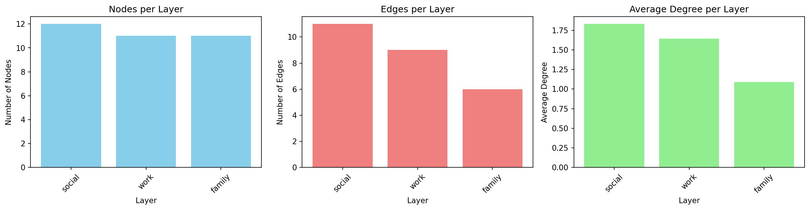
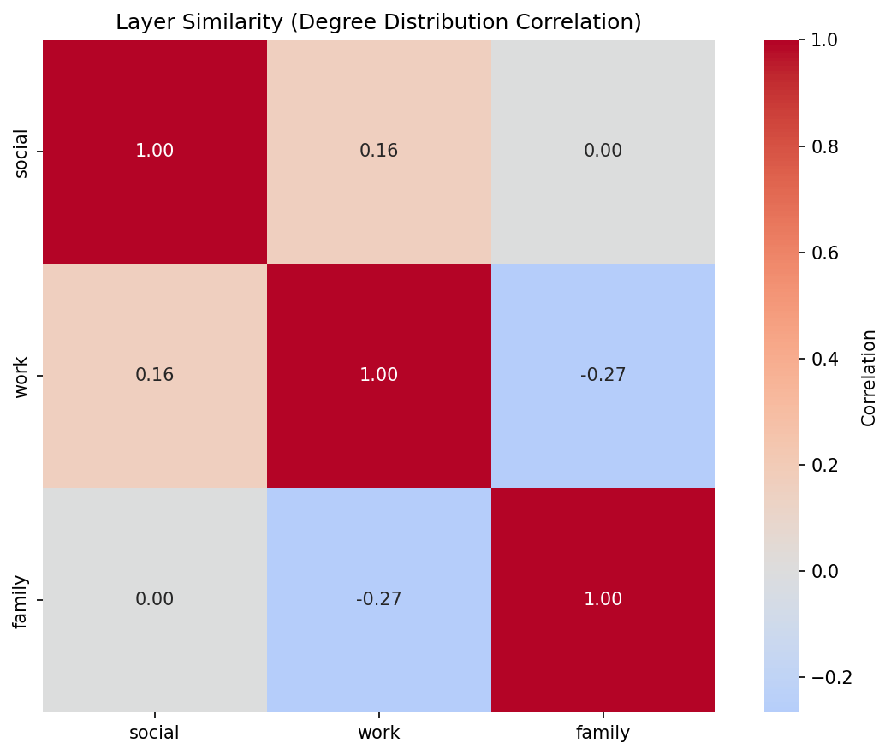
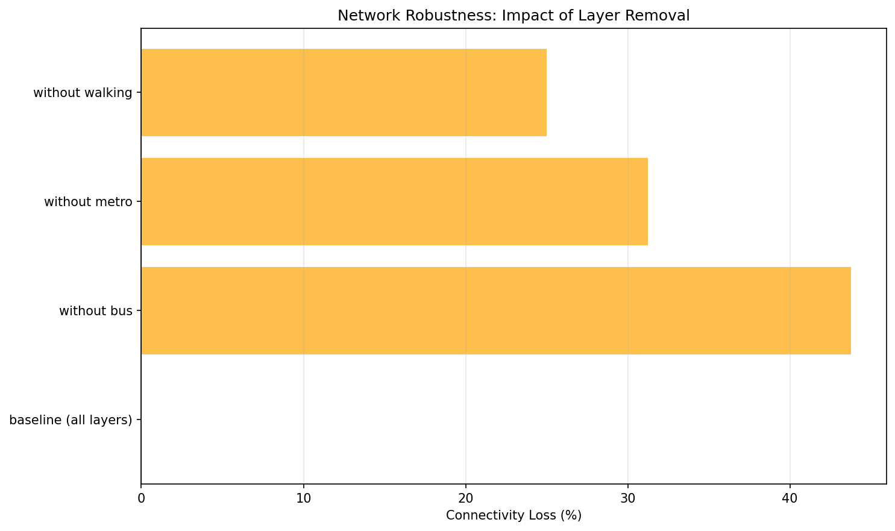

Query Zoo: DSL Gallery for Multilayer Analysis
==============================================

.. meta::
   :description: A gallery of example queries showcasing the py3plex DSL for multilayer network analysis
   :keywords: DSL, multilayer networks, query examples, graph analysis

**The Query Zoo is a curated gallery of DSL queries that demonstrate the expressiveness and power of py3plex for multilayer network analysis.**

Each example:

* Solves a real multilayer analysis problem
* Uses the DSL end-to-end with idiomatic patterns
* Produces concrete, reproducible outputs
* Is fully tested and documented

.. admonition:: Why a Query Zoo?
   :class: note

   The DSL is most powerful when you see it in action on realistic problems. 
   This gallery shows you **how** to think about multilayer queries, not just 
   **what** the syntax is. Use these examples as recipes and starting points 
   for your own analyses.

.. contents::
   :local:
   :depth: 2

Overview
--------

The Query Zoo is organized around common multilayer analysis tasks:

1. **Basic Multilayer Exploration** — Understand layer statistics and structure
2. **Cross-Layer Hubs** — Find nodes that are important across multiple layers
3. **Layer Similarity** — Measure structural alignment between layers
4. **Community Structure** — Detect and analyze multilayer communities
5. **Multiplex PageRank** — Compute multilayer-aware centrality
6. **Robustness Analysis** — Assess network resilience to layer failures
7. **Advanced Centrality Comparison** — Identify versatile vs specialized hubs

All examples use small, reproducible multilayer networks from the ``examples/dsl_query_zoo/datasets.py`` module.

.. tip::
   **Running the Examples**
   
   All query functions are available in ``examples/dsl_query_zoo/queries.py``. 
   To run all queries and generate outputs::
   
       python examples/dsl_query_zoo/run_all.py
   
   Test the queries with::
   
       pytest tests/test_dsl_query_zoo.py

----

1. Basic Multilayer Exploration
--------------------------------

**Problem:** You've loaded a multilayer network and want to quickly understand its structure. Which layers are densest? How many nodes and edges does each layer have?

**Solution:** Compute basic statistics per layer using the DSL.

Query Code
~~~~~~~~~~

.. literalinclude:: ../../examples/dsl_query_zoo/queries.py
   :pyobject: query_basic_exploration
   :language: python

Why It's Interesting
~~~~~~~~~~~~~~~~~~~~

* **First step in any analysis** — Before diving into complex queries, understand your data
* **Reveals layer diversity** — Different layers often have vastly different structures
* **Identifies sparse vs dense layers** — Helps decide which layers need special handling

Example Output
~~~~~~~~~~~~~~

Running on the ``social_work_network`` (12 people across social/work/family layers):

.. csv-table::
   :header: "Layer", "Nodes", "Edges", "Avg Degree"
   :widths: 25, 20, 20, 20

   "social", 12, 11, 1.83
   "work", 11, 9, 1.64
   "family", 11, 6, 1.09

**Interpretation:** The social layer is densest (highest average degree), while family is sparsest. All layers have similar numbers of nodes, indicating good cross-layer coverage.

DSL Concepts Demonstrated
~~~~~~~~~~~~~~~~~~~~~~~~~~

* ``Q.nodes().from_layers(L[name])`` — Select nodes from a specific layer
* ``.compute("degree")`` — Add computed attributes to results
* ``.execute(network)`` — Run the query and get results
* ``.to_pandas()`` — Convert to DataFrame for analysis

----

2. Cross-Layer Hubs
-------------------

**Problem:** Which nodes are consistently important across *multiple* layers? These "super hubs" are critical because they bridge different contexts.

**Solution:** Find top-k central nodes per layer, then identify which nodes appear in multiple layers' top lists.

Query Code
~~~~~~~~~~

.. literalinclude:: ../../examples/dsl_query_zoo/queries.py
   :pyobject: query_cross_layer_hubs
   :language: python

Why It's Interesting
~~~~~~~~~~~~~~~~~~~~

* **Reveals cross-context influence** — Nodes central in one layer might be peripheral in another
* **Identifies key connectors** — Nodes that appear in multiple layers' top-k are especially important
* **Robust hub detection** — More reliable than single-layer centrality

Example Output
~~~~~~~~~~~~~~

Top cross-layer hubs (k=5):

.. csv-table::
   :header: "Node", "Layer", "Degree", "Betweenness", "Layer Count"
   :widths: 20, 20, 15, 20, 15

   "Bob", "social", 3, 0.0273, 3
   "Bob", "work", 2, 0.0, 3
   "Bob", "family", 1, 0.0, 3
   "Alice", "work", 3, 0.0889, 2
   "Charlie", "social", 3, 0.0273, 2

**Interpretation:** Bob appears as a top-5 hub in *all three layers* (layer_count=3), making him the most versatile connector. Alice and Charlie are hubs in two layers each.

DSL Concepts Demonstrated
~~~~~~~~~~~~~~~~~~~~~~~~~~

* ``.compute("betweenness_centrality", "degree")`` — Compute multiple metrics at once
* ``.order_by("-betweenness_centrality")`` — Sort descending (``-`` prefix)
* ``.limit(k)`` — Take top-k results
* Per-layer iteration and aggregation across layers

----

3. Layer Similarity
-------------------

**Problem:** How similar are different layers structurally? Do they serve redundant or complementary roles?

**Solution:** Compute degree distributions per layer and measure pairwise correlations.

Query Code
~~~~~~~~~~

.. literalinclude:: ../../examples/dsl_query_zoo/queries.py
   :pyobject: query_layer_similarity
   :language: python

Why It's Interesting
~~~~~~~~~~~~~~~~~~~~

* **Detects redundancy** — High correlation suggests layers capture similar structure
* **Guides simplification** — Nearly identical layers might be merged
* **Reveals specialization** — Low/negative correlation shows layers serve different roles

Example Output
~~~~~~~~~~~~~~

Correlation matrix for ``social_work_network``:

.. csv-table::
   :header: "", "social", "work", "family"
   :widths: 25, 25, 25, 25

   "social", "1.000", "0.159", "0.000"
   "work", "0.159", "1.000", "-0.267"
   "family", "0.000", "-0.267", "1.000"

**Interpretation:** Social and work layers have weak positive correlation (0.159), suggesting some structural overlap. Family and work are *negatively* correlated (-0.267), indicating they capture different connectivity patterns.

DSL Concepts Demonstrated
~~~~~~~~~~~~~~~~~~~~~~~~~~

* Layer-by-layer degree computation
* Aggregating results across layers for meta-analysis
* Using computed attributes for layer-level comparisons

----

4. Community Structure
----------------------

**Problem:** What communities exist in the multilayer network? How do they manifest across layers?

**Solution:** Detect communities using multilayer community detection, then analyze their distribution across layers.

Query Code
~~~~~~~~~~

.. literalinclude:: ../../examples/dsl_query_zoo/queries.py
   :pyobject: query_community_structure
   :language: python

Why It's Interesting
~~~~~~~~~~~~~~~~~~~~

* **Mesoscale structure** — Communities reveal organizational patterns
* **Cross-layer community tracking** — See if communities are layer-specific or global
* **Dominant layers** — Identify which layer best represents each community

Example Output
~~~~~~~~~~~~~~

Running on ``communication_network`` (email/chat/phone layers):

.. csv-table::
   :header: "Community", "Layer", "Size", "Avg Degree", "Dominant Layer"
   :widths: 15, 15, 15, 20, 25

   0, "email", 10, 1.8, "email"
   1, "chat", 6, 2.17, "chat"
   2, "chat", 3, 1.67, "chat"
   3, "phone", 7, 1.71, "phone"

**Interpretation:** Community 0 is email-dominated (10 nodes), while communities 1 and 2 are chat-specific. Community 3 appears primarily in phone communication.

DSL Concepts Demonstrated
~~~~~~~~~~~~~~~~~~~~~~~~~~

* ``Q.nodes().from_layers(L["*"])`` — Select from all layers
* ``.compute("communities")`` — Built-in community detection
* Grouping by ``(community_id, layer)`` for analysis
* Identifying dominant layers via aggregation

----

5. Multiplex PageRank
---------------------

**Problem:** Standard PageRank treats each layer independently. How do we compute importance considering the full multiplex structure?

**Solution:** Compute PageRank per layer, then aggregate across layers. (Note: This is a simplified version; true multiplex PageRank uses supra-adjacency matrices.)

Query Code
~~~~~~~~~~

.. literalinclude:: ../../examples/dsl_query_zoo/queries.py
   :pyobject: query_multiplex_pagerank
   :language: python

Why It's Interesting
~~~~~~~~~~~~~~~~~~~~

* **Multilayer-aware centrality** — Accounts for importance across all layers
* **More robust than single-layer** — Averages out layer-specific biases
* **Essential for multiplex influence** — Key for viral marketing, information diffusion

Example Output
~~~~~~~~~~~~~~

Top nodes by multiplex PageRank in ``transport_network``:

.. csv-table::
   :header: "Node", "Multiplex PR", "Total Degree", "Bus PR", "Metro PR", "Walking PR"
   :widths: 25, 15, 15, 15, 15, 15

   "ShoppingMall", 0.1811, 6, 0.1362, 0.1909, 0.2164
   "Park", 0.1806, 4, 0.1449, 0.0, 0.2164
   "CentralStation", 0.1683, 6, 0.1971, 0.1909, 0.117
   "BusinessDistrict", 0.1484, 4, 0.079, 0.1994, 0.1667

**Interpretation:** ShoppingMall has highest multiplex PageRank (0.1811) because it's central across all three transport modes. Park has high walking PageRank but zero metro, reflecting its limited accessibility.

DSL Concepts Demonstrated
~~~~~~~~~~~~~~~~~~~~~~~~~~

* ``.compute("pagerank")`` — Built-in PageRank computation
* Per-layer iteration with result aggregation
* Pivot tables for layer-wise breakdowns
* Combining degree and PageRank for richer analysis

----

6. Robustness Analysis
----------------------

**Problem:** How robust is the network to layer failures? What happens if one layer goes offline?

**Solution:** Simulate removing each layer and measure connectivity loss.

Query Code
~~~~~~~~~~

.. literalinclude:: ../../examples/dsl_query_zoo/queries.py
   :pyobject: query_robustness_analysis
   :language: python

Why It's Interesting
~~~~~~~~~~~~~~~~~~~~

* **Critical infrastructure identification** — Reveals which layers are essential
* **Redundancy assessment** — High robustness indicates good backup coverage
* **Failure planning** — Informs which layers need extra protection

Example Output
~~~~~~~~~~~~~~

Robustness of ``transport_network``:

.. csv-table::
   :header: "Scenario", "Nodes", "Avg Degree", "Total Edges", "Connectivity Loss (%)"
   :widths: 30, 15, 15, 15, 20

   "baseline (all layers)", 14, 2.14, 15, 0.0
   "without bus", 11, 1.45, 8, 46.67
   "without metro", 11, 1.82, 10, 33.33
   "without walking", 14, 2.0, 14, 6.67

**Interpretation:** Removing the bus layer causes 46.67% connectivity loss — it's the most critical layer. Walking is least critical (only 6.67% loss), indicating good redundancy from other transport modes.

DSL Concepts Demonstrated
~~~~~~~~~~~~~~~~~~~~~~~~~~

* Layer algebra: ``L["layer1"] + L["layer2"]`` — Combine layers
* ``Q.nodes().from_layers(layer_expr)`` — Query with dynamic layer selections
* Baseline vs scenario comparison
* Measuring connectivity metrics before/after perturbations

----

7. Advanced Centrality Comparison
----------------------------------

**Problem:** Different centralities capture different notions of importance. Which nodes are "versatile hubs" (high in many centralities) vs "specialized hubs" (high in only one)?

**Solution:** Compute multiple centralities, normalize them, and classify nodes by how many centralities place them in the top tier.

Query Code
~~~~~~~~~~

.. literalinclude:: ../../examples/dsl_query_zoo/queries.py
   :pyobject: query_advanced_centrality_comparison
   :language: python

Why It's Interesting
~~~~~~~~~~~~~~~~~~~~

* **Centrality is multifaceted** — Degree ≠ betweenness ≠ closeness ≠ PageRank
* **Versatile hubs are robust** — High across many metrics means genuine importance
* **Specialized hubs reveal roles** — High in one metric reveals specific structural position

Example Output
~~~~~~~~~~~~~~

Running on ``communication_network`` (email layer):

.. csv-table::
   :header: "Node", "Degree", "Betweenness", "Closeness", "PageRank", "Versatility", "Type"
   :widths: 20, 12, 15, 15, 13, 12, 18

   "Manager", 9, 1.0, 1.0, 0.4676, 4, "versatile_hub"
   "Dev1", 1, 0.0, 0.5294, 0.0592, 0, "peripheral"
   "Dev2", 1, 0.0, 0.5294, 0.0592, 0, "peripheral"

**Interpretation:** Manager is a **versatile hub** (top 30% in all 4 centralities). All other nodes are peripheral in this star-topology email network.

DSL Concepts Demonstrated
~~~~~~~~~~~~~~~~~~~~~~~~~~

* ``.compute("degree", "betweenness_centrality", "closeness_centrality", "pagerank")`` — Compute multiple centralities
* Normalizing centralities for comparison
* Derived metrics (versatility score)
* Classification based on computed attributes

----

Using the Query Zoo
-------------------

Getting Started
~~~~~~~~~~~~~~~

1. **Install py3plex** (if not already installed)::

       pip install py3plex

2. **Run a single query**::

       from examples.dsl_query_zoo.datasets import create_social_work_network
       from examples.dsl_query_zoo.queries import query_basic_exploration
       
       net = create_social_work_network(seed=42)
       result = query_basic_exploration(net)
       print(result)

3. **Run all queries**::

       cd examples/dsl_query_zoo
       python run_all.py

4. **Run tests**::

       pytest tests/test_dsl_query_zoo.py -v

Adapting Queries to Your Data
~~~~~~~~~~~~~~~~~~~~~~~~~~~~~~

All queries are designed to work with any ``multi_layer_network`` object. To adapt:

1. **Replace the dataset**:

   .. code-block:: python

       from py3plex.core import multinet
       
       # Load your own network
       my_network = multinet.multi_layer_network()
       my_network.load_network("mydata.edgelist", input_type="edgelist_mx")
       
       # Run any query
       result = query_cross_layer_hubs(my_network, k=10)

2. **Adjust parameters**:

   * ``k`` in ``query_cross_layer_hubs`` — Number of top nodes per layer
   * Layer names in filters — Replace ``L["social"]`` with your layer names
   * Centrality thresholds — Adjust percentile cutoffs as needed

3. **Extend queries**:

   All query functions are in ``examples/dsl_query_zoo/queries.py``. Copy, modify, and experiment!

Datasets
~~~~~~~~

Three multilayer networks are provided:

1. **social_work_network**

   * **Layers:** social, work, family
   * **Nodes:** 12 people
   * **Structure:** Overlapping social circles with different connectivity patterns per layer

2. **communication_network**

   * **Layers:** email, chat, phone
   * **Nodes:** 10 people (Manager, Dev team, Marketing, Support, HR)
   * **Structure:** Star topology in email, distributed in chat/phone

3. **transport_network**

   * **Layers:** bus, metro, walking
   * **Nodes:** 8 locations (CentralStation, ShoppingMall, Park, etc.)
   * **Structure:** Bus covers most locations, metro is faster but selective, walking is local

All datasets use fixed random seeds (``seed=42``) for reproducibility.

Further Reading
---------------

* :doc:`query_with_dsl` — Complete DSL reference with syntax and operators
* :doc:`../concepts/multilayer_networks_101` — Theory of multilayer networks
* :doc:`../reference/dsl_reference` — Full DSL grammar and API reference
* :doc:`../tutorials/tutorial_10min` — Quick start tutorial

.. admonition:: Contributing Queries
   :class: tip

   Have an interesting multilayer query pattern? **Contribute it to the Query Zoo!**
   
   1. Add your query function to ``examples/dsl_query_zoo/queries.py``
   2. Add tests to ``tests/test_dsl_query_zoo.py``
   3. Update this documentation page
   4. Submit a pull request!
   
   See :doc:`../project/contributing` for details.
