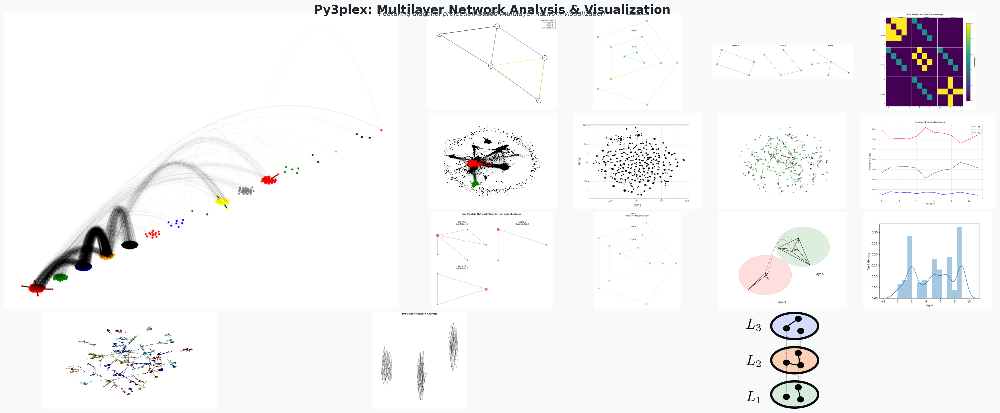

Py3plex Documentation
**********************************

.. image:: https://github.com/SkBlaz/py3plex/actions/workflows/tests.yml/badge.svg
   :target: https://github.com/SkBlaz/py3plex/actions/workflows/tests.yml
   :alt: Tests

.. image:: https://github.com/SkBlaz/py3plex/actions/workflows/code-quality.yml/badge.svg
   :target: https://github.com/SkBlaz/py3plex/actions/workflows/code-quality.yml
   :alt: Code Quality

py3plex enables scalable analysis and visualization of multilayer and multiplex networks in Python, supporting complex network modeling across diverse scientific and applied domains.

Overview
========

What is py3plex Actually For?
-----------------------------

py3plex is a lightweight Python library designed specifically for analyzing and visualizing **heterogeneous and multilayer networks**—network structures where relationships are richer and more complex than simple graphs. Unlike traditional network analysis tools that focus on homogeneous networks (single node and edge type), py3plex provides specialized capabilities for networks with:

* **Multiple node types** (e.g., authors, papers, venues in an academic network)
* **Multiple edge types** (e.g., friendship, mentorship, collaboration)
* **Multiple layers of interaction** (e.g., different social platforms, modes of transportation)
* **Temporal dynamics** (e.g., evolving relationships over time)
* **Heterogeneous attributes** (e.g., edge weights varying by relationship type)

Real-world systems are rarely simple: a social network involves friendships *and* professional relationships; a transportation system includes buses *and* trains *and* flights; a biological system has protein-protein interactions *and* gene regulation *and* metabolic pathways. When you model these systems as multilayer networks rather than flattening them into a single graph, you preserve information that matters for analysis—and py3plex makes this kind of analysis practical.

**Target Users:** Researchers in network science, computational biology, complex systems, social network analysis, infrastructure/transportation modeling, and applied ML on graphs.

What Can I Do in the First Hour, First Day, and First Week?
-----------------------------------------------------------

**First Hour:**

* Install py3plex and create your first multilayer network (see :doc:`getting_started/quickstart_5min`)
* Load a dataset, compute basic statistics, and visualize your network with one of the built-in layouts
* Query your network with the SQL-like DSL (``SELECT nodes WHERE layer="friends" AND degree > 5``)

**First Day:**

* Work through the 10-minute tutorial for a complete workflow (see :doc:`getting_started/tutorial_10min`)
* Compute multilayer statistics: layer density, node activity, edge overlap between layers
* Detect communities using multilayer Louvain and visualize them with community colors
* Generate random walks and create basic node embeddings for ML tasks

**First Week:**

* Understand the core model: node-layer pairs, supra-adjacency matrices, and how py3plex extends NetworkX
* Implement complete analysis pipelines: load → compute statistics → detect communities → visualize → export
* Tune algorithm parameters (resolution, inter-layer coupling) for your specific domain
* Build production-ready workflows with Arrow/Parquet I/O for scalability

When Should I Use py3plex Instead of Just NetworkX?
---------------------------------------------------

NetworkX is excellent for single-layer, homogeneous networks. Use py3plex when:

1. **Your data has natural layers.** If you're tempted to add a ``layer`` attribute to NetworkX edges or to maintain multiple separate graphs, py3plex gives you a principled representation and layer-aware algorithms.

2. **You need multilayer-specific metrics.** Statistics like node activity (how many layers a node participates in), edge overlap (how many edges appear in multiple layers), or versatility centrality (node importance across layers) require multilayer-aware implementations.

3. **You want consistent cross-layer analysis.** Multilayer community detection finds groups that are consistent across layers. Multilayer centrality identifies nodes that are important in their context, not just locally.

4. **You need specialized visualization.** Diagonal projection and layered layouts show multilayer structure clearly. Hairball plots with layer-colored nodes reveal cross-layer patterns.

5. **You want a SQL-like query interface.** The py3plex DSL lets you query and filter networks intuitively (``SELECT edges WHERE source_layer="l1" AND weight > 0.5``).

If your network is genuinely a single layer with one node type and one edge type, plain NetworkX is sufficient. py3plex adds value when that simplifying assumption doesn't hold.

**Key Features:**

* Native support for multiplex and multilayer network structures
* **SQL-like DSL** for intuitive network queries and analysis
* Diagonal projection visualization for large multilayer networks
* Comprehensive multilayer centrality measures (17+ statistics)
* Community detection across network layers (Louvain, Infomap, multilayer modularity)
* Network decomposition and feature extraction for ML
* Random walk and node embedding algorithms (Node2Vec, DeepWalk)
* High-performance I/O with Arrow/Parquet for large-scale analysis
* Integration with NetworkX, igraph, and other graph libraries

Typical Workflows
-----------------

py3plex supports three main workflow patterns:

**1. Exploratory Multilayer Network Analysis (Medium-sized Datasets)**

For networks with a few thousand nodes across 2–10 layers, this is the most common workflow:

* **Load:** Read your multilayer edgelist, GraphML, or CSV
* **Explore:** Run ``basic_stats()``, examine layer densities, node activity distributions
* **Analyze:** Compute multilayer statistics, detect communities, compute centralities
* **Visualize:** Create hairball plots with community colors, diagonal projections
* **Iterate:** Refine layer selection, tune parameters, re-analyze

*Best for:* Social network analysis, biological networks (PPI, gene regulation), citation networks

**2. Feature Extraction + Embeddings for ML Tasks**

When your goal is to use network structure as features for machine learning:

* **Load:** Import your network
* **Generate walks:** Use ``generate_walks()`` with Node2Vec-style biased sampling
* **Train embeddings:** Feed walks to Word2Vec or use py3plex's embedding wrappers
* **Export features:** Create node-level feature vectors for classification or link prediction
* **Integrate:** Use embeddings in scikit-learn pipelines or deep learning models

*Best for:* Node classification, link prediction, graph-level classification, similarity search

**3. Large-Scale Multilayer Analysis (Performance Constraints)**

For networks with 100k+ nodes or when running many experiments:

* **Use Arrow/Parquet I/O:** 2–3x faster read/write than JSON, better compression
* **Work layer-by-layer:** Extract single layers for independent analysis when possible
* **Use sparse matrices:** Always use ``sparse=True`` for supra-adjacency matrices
* **Sample for exploration:** Use subnetworks and random sampling for initial exploration
* **Batch processing:** Use CLI/Docker for reproducible, scriptable analysis

*Best for:* Large social graphs, infrastructure networks, repeated experiments, production pipelines

Design at a Glance
------------------

py3plex is organized into four main components:

**Core (``py3plex.core``):**

The ``multi_layer_network`` class wraps NetworkX MultiGraph/MultiDiGraph with layer-aware semantics. Nodes are represented as ``(node_id, layer_id)`` tuples, enabling the same entity to appear in multiple layers. This representation is compatible with all NetworkX algorithms while providing multilayer-specific operations.

**Algorithms (``py3plex.algorithms``):**

* **Statistics:** Layer density, node activity, edge overlap, versatility centrality, and more
* **Community detection:** Louvain, Infomap, multilayer modularity (Mucha et al. 2010)
* **Centrality:** Multilayer degree, betweenness, closeness, PageRank
* **Random walks:** Basic walks, Node2Vec-style biased walks, layer-constrained walks

**Visualization (``py3plex.visualization``):**

* **Hairball plots:** Force-directed layouts with layer coloring
* **Diagonal projection:** 3D-like representation showing layer structure
* **Community visualization:** Nodes colored by detected community

**I/O (``py3plex.io``):**

* **Traditional formats:** Edgelist, multiedgelist, GraphML, GML, pickle
* **Modern formats:** Apache Arrow, Parquet for high-performance serialization
* **Schema-based API:** ``read()`` and ``write()`` with automatic format detection

Installation
============

Install from GitHub
-------------------

.. code-block:: bash

    pip install git+https://github.com/SkBlaz/py3plex.git

Docker Installation (Alternative)
----------------------------------

py3plex is also available as a Docker container with all dependencies pre-installed:

.. code-block:: bash

    # Clone and build
    git clone https://github.com/SkBlaz/py3plex.git
    cd py3plex
    docker build -t py3plex:latest .

    # Run commands
    docker run --rm py3plex:latest --version
    docker run --rm py3plex:latest selftest

See :doc:`deployment/cli_and_docker` for complete Docker documentation.

Install from source for development
------------------------------------

.. code-block:: bash

    git clone https://github.com/SkBlaz/py3plex.git
    cd py3plex
    pip install -e .

Optional Dependencies
---------------------

.. code-block:: bash

    # Advanced community detection with Infomap
    pip install git+https://github.com/SkBlaz/py3plex.git#egg=py3plex[infomap]

    # Additional algorithms (Louvain, cdlib)
    pip install git+https://github.com/SkBlaz/py3plex.git#egg=py3plex[algos]

    # Advanced visualization (plotly, igraph)
    pip install git+https://github.com/SkBlaz/py3plex.git#egg=py3plex[viz]

    # For development (includes testing and linting tools)
    pip install -e ".[dev]"

Requirements
------------

* Python 3.8 or higher
* NetworkX, NumPy, SciPy (automatically installed)
* Optional: Matplotlib, Plotly for visualization

Quick Start
===========

Create a simple multilayer network:

.. code-block:: python

    from py3plex.core import multinet

    # Create a new multilayer network
    network = multinet.multi_layer_network()

    # Add edges within layers
    network.add_edges([
        ['A', 'layer1', 'B', 'layer1', 1],
        ['B', 'layer1', 'C', 'layer1', 1],
        ['A', 'layer2', 'B', 'layer2', 1],
    ], input_type="list")

    # Display basic statistics
    network.basic_stats()

    # Visualize
    from py3plex.visualization.multilayer import draw_multilayer_default
    draw_multilayer_default([network], display=True)

Load from file and analyze:

.. code-block:: python

    # Load from edge list
    network = multinet.multi_layer_network().load_network(
        "data.edgelist", input_type="edgelist", directed=False)

    # Compute multilayer statistics
    from py3plex.algorithms.statistics import multilayer_statistics as mls
    density = mls.layer_density(network, 'layer1')
    versatility = mls.versatility_centrality(network, centrality_type='degree')

    # Community detection
    from py3plex.algorithms.community_detection import community_wrapper
    communities = community_wrapper.best_partition(network.core_network)

Query with DSL (SQL-like syntax):

.. code-block:: python

    from py3plex.dsl import execute_query
    
    # Query nodes by layer and degree
    result = execute_query(network, 'SELECT nodes WHERE layer="layer1" AND degree > 1')
    
    # Compute centrality for filtered nodes
    result = execute_query(network, 'SELECT nodes WHERE layer="layer1" COMPUTE betweenness_centrality')
    
See :doc:`user_guide/dsl` for comprehensive DSL documentation.

Pythonic interface - use networks naturally:

.. code-block:: python

    from py3plex.core.multinet import multi_layer_network
    
    # Create from edges directly with factory method
    network = multi_layer_network.from_edges([
        {'source': 'A', 'target': 'B', 'source_type': 'l1', 'target_type': 'l1'},
        {'source': 'B', 'target': 'C', 'source_type': 'l1', 'target_type': 'l1'}
    ])
    
    # Use len(), bool, and 'in' naturally
    if network:  # True if network has nodes
        print(f"{len(network)} nodes across {network.layer_count} layers")
    
    if ('A', 'l1') in network:  # Check membership
        print("Node A exists in layer l1")
    
    # Iterate directly
    for node in network:
        print(node)
    
    # Method chaining
    network.add_nodes([{'source': 'D', 'type': 'l1'}]).add_edges([...])

See :doc:`user_guide/networks` for complete Pythonic interface documentation.

Why py3plex?
============

vs. NetworkX
------------

NetworkX excels at single-layer homogeneous networks but lacks native multilayer support. py3plex builds on NetworkX while adding:

* Native multilayer data structures
* Layer-aware algorithms
* Specialized multilayer visualizations
* Heterogeneous network decomposition

vs. Other Multilayer Tools
---------------------------

py3plex provides:

* Lightweight and easy to integrate
* Comprehensive statistical measures (17+ multilayer metrics)
* Publication-ready visualizations
* Active development and research backing

Use Cases
=========

py3plex is particularly well-suited for:

* **Biological networks:** Protein-protein interactions with multiple evidence types, gene regulatory networks
* **Social networks:** Multi-platform analysis (Twitter + Facebook), relationship type analysis
* **Citation networks:** Author-paper-venue multilayer structures, knowledge graphs
* **Transportation:** Multi-modal networks (bus, train, air), urban mobility
* **Temporal networks:** Evolving social networks, dynamic community evolution

What's in this Documentation?
==============================

This documentation is organized as a comprehensive guide that takes you from beginner to advanced user. It's structured in eight parts that you can read sequentially like a book, or jump to specific sections based on your needs:

**Part I - Getting Started:** New to py3plex? Begin with the 5-minute quickstart (:doc:`getting_started/quickstart_5min`) for a hands-on introduction, then continue to the 10-minute tutorial (:doc:`getting_started/tutorial_10min`) for a comprehensive walkthrough.

**Part II - Concepts & Architecture:** Want to understand the theory? Check out :doc:`concepts/multilayer_networks_101` for foundational concepts and :doc:`concepts/py3plex_core_model` for py3plex's design philosophy.

**Part III - User Guide:** Ready to dive deep? The user guide chapters cover every major feature from network creation to visualization, each building on the previous.

**Part IV - Deployment:** Moving to production? See the :doc:`deployment/cli_and_docker` and :doc:`deployment/performance_scalability` guides for deployment strategies.

**Part V - GUI:** Prefer a visual interface? The GUI section covers the web-based interface for interactive network exploration.

**Part VI - Developer Docs:** Want to contribute? Read the :doc:`dev/development_guide` and :doc:`dev/contributing` pages.

**Part VII - Examples:** Learning by doing? Browse the curated :doc:`examples/index` for working code.

**Part VIII - Reference:** Need API details? The reference section provides comprehensive algorithm and API documentation.

Documentation Contents
======================

----

Part I: Getting Started
-----------------------

Whether you're new to py3plex or multilayer network analysis, this section provides everything you need to get up and running quickly. We begin with a 5-minute quickstart that demonstrates the core concepts through hands-on examples, then expand into a comprehensive 10-minute tutorial covering the most common workflows. The installation guide ensures you have all dependencies configured correctly, while the troubleshooting section addresses common issues you might encounter.

.. toctree::
   :maxdepth: 2
   :caption: Getting Started

   getting_started/quickstart_5min
   getting_started/tutorial_10min
   getting_started/installation
   getting_started/common_issues

----

Part II: Concepts & Architecture
--------------------------------

Before diving deeper into py3plex's capabilities, it's essential to understand the theoretical foundations of multilayer networks. This section introduces the core concepts that distinguish multilayer networks from traditional graph structures, explains py3plex's internal data model and design philosophy, and provides an overview of the algorithmic landscape available for multilayer network analysis. Understanding these foundations will help you make better decisions when designing your analysis workflows.

.. toctree::
   :maxdepth: 2
   :caption: Concepts & Architecture

   concepts/multilayer_networks_101
   concepts/py3plex_core_model
   concepts/design_principles
   concepts/algorithm_landscape

----

Part III: User Guide
--------------------

With the fundamentals in place, this section provides comprehensive how-to guides for every major feature of py3plex. You'll learn how to create and manipulate multilayer networks, compute network statistics and centrality measures, detect communities across layers, perform random walks for embeddings, handle various input/output formats, create publication-ready visualizations, use the SQL-like DSL for intuitive queries, and combine these techniques into complete analysis workflows. Each chapter builds on the previous ones, creating a progressive learning path.

.. toctree::
   :maxdepth: 2
   :caption: User Guide

   user_guide/networks
   user_guide/statistics
   user_guide/community_detection
   user_guide/random_walks_embeddings
   user_guide/io_and_formats
   user_guide/visualization
   user_guide/dsl
   user_guide/recipes_and_workflows

----

Part IV: Environments & Deployment
----------------------------------

Moving from development to production requires careful consideration of deployment strategies and performance optimization. This section covers how to use py3plex via command-line interfaces and Docker containers for reproducible analyses, as well as techniques for scaling to large networks and optimizing performance for demanding workloads.

.. toctree::
   :maxdepth: 2
   :caption: Environments & Deployment

   deployment/cli_and_docker
   deployment/performance_scalability

----

Part V: Py3plex GUI
-------------------

For users who prefer a graphical interface, py3plex provides a web-based GUI for interactive network exploration and analysis. This section covers everything from basic usage to deployment, API integration, and testing. The GUI makes py3plex accessible to users who may not be comfortable with Python scripting while still providing access to the library's powerful analytical capabilities.

.. toctree::
   :maxdepth: 2
   :caption: Py3plex GUI

   gui/gui_user_guide
   gui/gui_deployment
   gui/gui_api_reference
   gui/gui_architecture
   gui/gui_testing

----

Part VI: Developer & Contributor Docs
-------------------------------------

If you're interested in contributing to py3plex or understanding its internal architecture for extension purposes, this section provides the necessary guidance. We cover development environment setup, code architecture and organization, repository layout, and contribution guidelines. Open-source contributions are welcomed and appreciated.

.. toctree::
   :maxdepth: 2
   :caption: Developer & Contributor Docs

   dev/development_guide
   dev/code_architecture
   dev/repo_layout
   dev/contributing

----

Part VII: Examples
------------------

Learning by example is often the most effective approach. This section provides a curated collection of working code examples that demonstrate py3plex's capabilities across various use cases. From basic network creation to advanced analysis workflows, these examples serve as templates for your own projects.

.. toctree::
   :maxdepth: 1
   :caption: Examples

   examples/index

----

Part VIII: Reference & Citation
-------------------------------

This final section provides comprehensive reference materials including the complete algorithm reference, API documentation, and citation information. If you use py3plex in your research, please cite the original publication to support continued development.

.. toctree::
   :maxdepth: 2
   :caption: Reference & Citation

   reference/algorithm_reference
   reference/api_index
   reference/citation_and_acknowledgements

Examples
========

The best way to learn py3plex is through examples.

All examples are available in the `examples/ directory <https://github.com/SkBlaz/Py3Plex/tree/master/examples>`_.

Key examples:

* ``tutorial_10min.py`` - Executable version of the 10-minute tutorial
* ``example_dsl_queries.py`` - SQL-like DSL for network queries
* ``example_dsl_advanced.py`` - Advanced DSL queries and analysis
* ``example_random_walks.py`` - Random walk primitives (Node2Vec, DeepWalk)
* ``example_multilayer_visualization.py`` - Network visualization
* ``example_community_detection.py`` - Community detection with Louvain and Infomap
* ``example_network_decomposition.py`` - Meta-path feature extraction
* ``example_multilayer_statistics.py`` - Computing multilayer metrics
* ``example_n2v_embedding.py`` - Node2Vec embeddings
* ``example_label_propagation.py`` - Semi-supervised learning

Citation
========

If you use py3plex in your research, please cite:

.. code-block:: bibtex

    @Article{Skrlj2019,
      author={Škrlj, Blaž and Kralj, Jan and Lavrač, Nada},
      title={Py3plex toolkit for visualization and analysis of multilayer networks},
      journal={Applied Network Science},
      year={2019},
      volume={4},
      number={1},
      pages={94},
      doi={10.1007/s41109-019-0203-7}
    }

Indices and Tables
==================

* :ref:`genindex`
* :ref:`modindex`
* :ref:`search`
