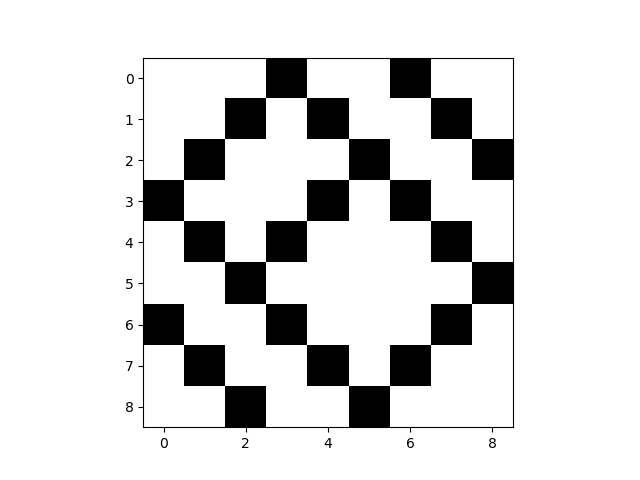

Supra-Adjacency Matrices
=========================

Multiplex networks can be represented as supra-adjacency matrices for tensor-based operations.

.. code-block:: python

    from py3plex.core import multinet, random_generators
    
    # Generate network
    network = random_generators.random_multilayer_ER(
        num_nodes=500, num_layers=8, probability=0.05, directed=False)
    
    # Get supra-adjacency matrix
    supra_matrix = network.get_supra_adjacency_matrix()
    
    # Visualize matrix
    network.visualize_matrix({"display": True})

Examples
--------

See:

- ``example_supra_adjacency.py`` - Supra-adjacency operations
- ``example_tensorial_manipulation.py`` - Tensor operations

Repository: https://github.com/SkBlaz/Py3Plex/tree/master/examples

Tensor-Like Indexing
--------------------

You can access nodes and edges using tensor-like indexing:

.. code-block:: python

    from py3plex.core import multinet
    from py3plex.core import random_generators

    # Initiate an instance of a random graph
    ER_multilayer = random_generators.random_multilayer_ER(500, 8, 0.05, directed=False)

    # Some simple visualization
    visualization_params = {"display": True}
    ER_multilayer.visualize_matrix(visualization_params)

    # Get some nodes and edges
    some_nodes = [node for node in ER_multilayer.get_nodes()][0:5]
    some_edges = [edge for edge in ER_multilayer.get_edges()][0:5]

    # Random node is accessed as follows
    print(ER_multilayer[some_nodes[0]])

    # Random edge is accessed as
    print(ER_multilayer[some_edges[0][0]][some_edges[0][1]])
