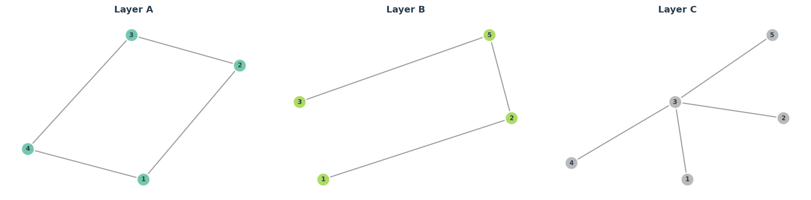
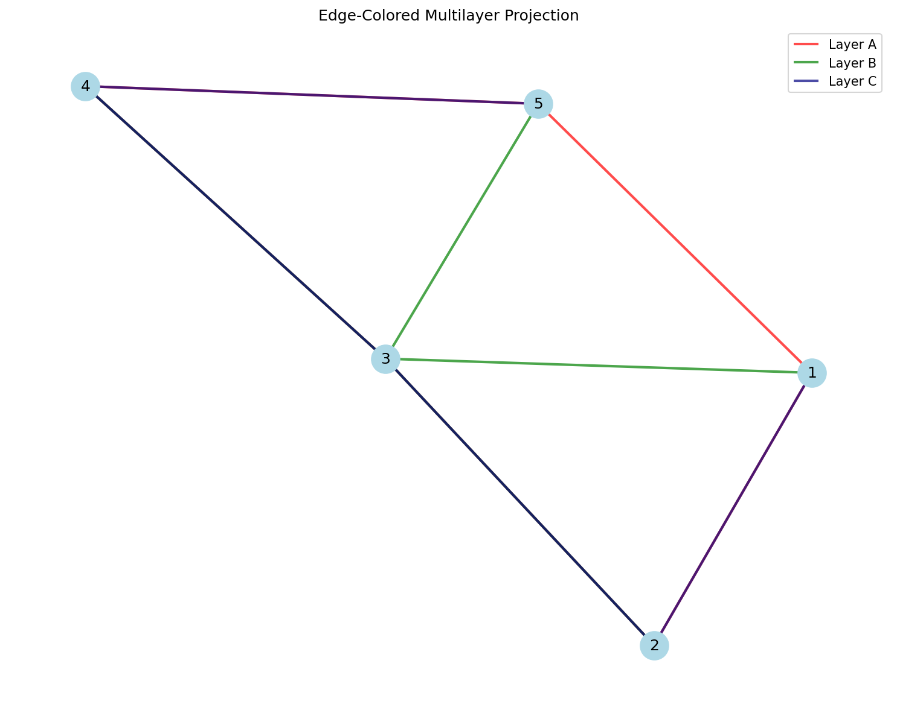
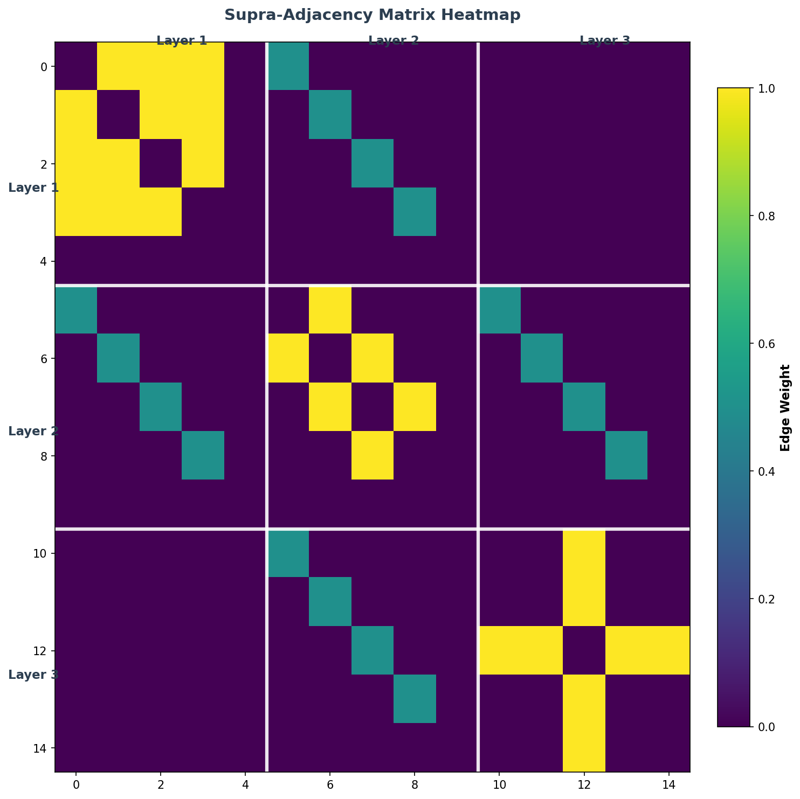
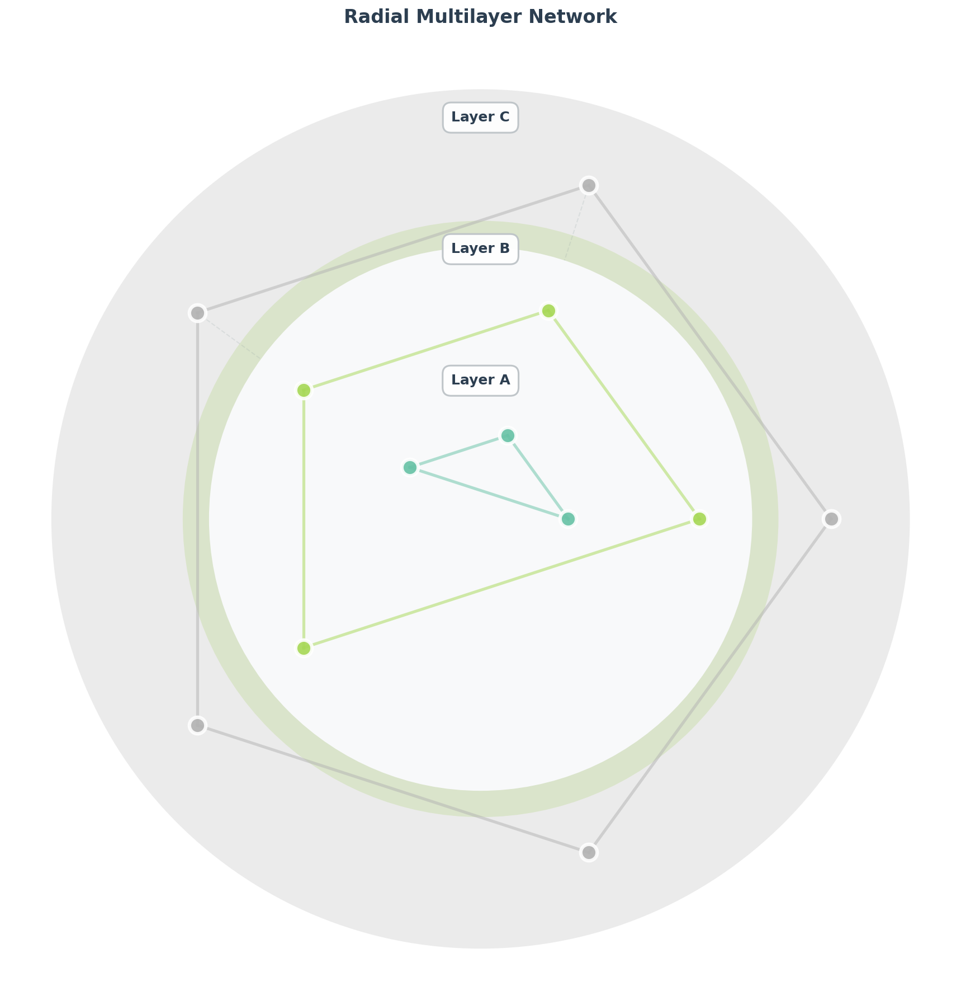
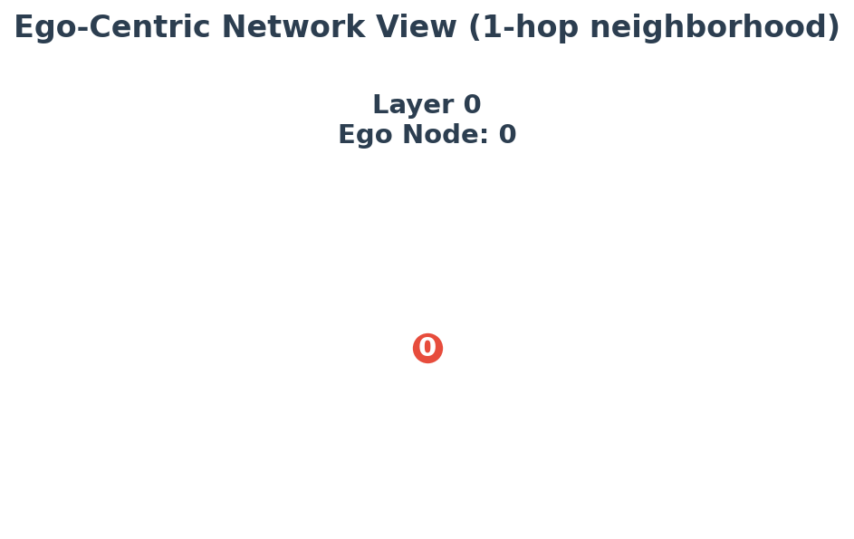

Visualization
=============

*From hairball to insight: making multilayer networks visible.*

----

.. image:: ../../example_images/py3plex_showcase.png
   :alt: Py3plex Visualization Showcase
   :align: center
   :width: 100%

A network you can't see is a network you can't understand. Visualization transforms abstract adjacency structures into spatial patterns that human perception can process—clusters become visible groups, hubs become prominent nodes, and cross-layer connections become the bridges they conceptually are.

This chapter shows you how to create visualizations that reveal structure rather than obscure it. We'll cover:

- **Quick plots** for exploration and debugging
- **Preset modes** optimized for different network scales
- **Layout algorithms** that reveal different structural properties
- **Interactive visualizations** for presentations and exploration
- **Publication-ready figures** with proper formatting

.. contents:: Table of Contents
   :local:
   :depth: 2

----

Quick Start
-----------

Basic Multilayer Visualization
~~~~~~~~~~~~~~~~~~~~~~~~~~~~~~~

.. code-block:: python

    from py3plex.core import multinet
    from py3plex.visualization.multilayer import draw_multilayer_default
    import matplotlib.pyplot as plt
    
    # Load network
    network = multinet.multi_layer_network()
    network.load_network("network.csv", input_type="multiedgelist")
    
    # Visualize with defaults
    draw_multilayer_default(
        network.get_layers(),
        display=True,
        labels=True
    )

Preset Visualization Modes
---------------------------

Py3plex provides three preset modes optimized for different network scales and use cases.

Minimal Mode (Large Networks >1000 nodes)
~~~~~~~~~~~~~~~~~~~~~~~~~~~~~~~~~~~~~~~~~~

Optimized for networks with many nodes where detail isn't critical.

.. code-block:: python

    from py3plex.visualization.multilayer import draw_multilayer_default
    
    # Minimal preset for large networks
    draw_multilayer_default(
        network.get_layers(),
        # Node settings
        node_size=5,              # Small nodes
        labels=False,             # No node labels (too cluttered)
        node_labels=False,        # No node IDs
        
        # Edge settings
        edge_size=0.5,            # Thin edges
        alphalevel=0.3,           # Transparent edges (reduce clutter)
        
        # Layout
        background_shape="circle",  # Circular layout
        
        # Display
        display=True,
        remove_isolated_nodes=True  # Clean up isolated nodes
    )

**Use cases:**
- Large social networks (>1000 nodes)
- Overview visualizations
- Pattern detection at macro level
- Network topology understanding

**Advantages:**
- Fast rendering
- Reduced visual clutter
- Shows overall structure
- Works with many nodes

Balanced Mode (Medium Networks 100-1000 nodes)
~~~~~~~~~~~~~~~~~~~~~~~~~~~~~~~~~~~~~~~~~~~~~~~

Default settings that work well for most networks. Good balance between detail and clarity.

.. code-block:: python

    # Balanced preset (this is the default)
    draw_multilayer_default(
        network.get_layers(),
        # Node settings
        node_size=10,             # Medium nodes
        labels=True,              # Show layer labels
        node_labels=False,        # Node IDs hidden by default
        
        # Edge settings
        edge_size=1.0,            # Normal edge width
        alphalevel=0.13,          # Semi-transparent edges
        
        # Layout
        background_shape="circle",  # Circular layout
        networks_color="rainbow",   # Auto-assign colors
        
        # Display
        display=True
    )

**Use cases:**
- Most research networks
- Exploratory data analysis
- Publication figures (moderate detail)
- Interactive exploration

**Advantages:**
- Good readability
- Reasonable performance
- Balanced aesthetics
- Suitable for most publications

Dense Mode (Small Networks <100 nodes)
~~~~~~~~~~~~~~~~~~~~~~~~~~~~~~~~~~~~~~~

Maximum detail for small networks where every node and edge matters.

.. code-block:: python

    # Dense preset for small, detailed networks
    draw_multilayer_default(
        network.get_layers(),
        # Node settings
        node_size=20,             # Large nodes
        labels=True,              # Show all labels
        node_labels=True,         # Show node IDs
        node_font_size=10,        # Readable font
        scale_by_size=True,       # Scale by degree
        
        # Edge settings
        edge_size=2.0,            # Thick edges
        alphalevel=0.8,           # Mostly opaque
        arrowsize=0.5,            # Visible arrows (if directed)
        
        # Layout
        background_shape="rectangle",  # Rectangular layout
        networks_color="rainbow",
        
        # Display
        display=True
    )

**Use cases:**
- Small case studies
- Detailed analysis
- Node-level examination
- High-quality publication figures

**Advantages:**
- Maximum detail
- Clear node identification
- Edge weights visible
- Professional appearance

Layout Options
--------------

Py3plex supports multiple layout algorithms for different network structures.

Circular Layout (Default)
~~~~~~~~~~~~~~~~~~~~~~~~~~

Arranges layers in a circle. Good for showing inter-layer connections.

.. code-block:: python

    draw_multilayer_default(
        network.get_layers(),
        background_shape="circle",
        rectanglex=1.0,  # Circle radius x
        rectangley=1.0   # Circle radius y
    )

**Best for:**
- 2-10 layers
- Symmetric layer interactions
- Publication figures

Rectangular Layout
~~~~~~~~~~~~~~~~~~

Arranges layers in a grid. Good for many layers or hierarchical structures.

.. code-block:: python

    draw_multilayer_default(
        network.get_layers(),
        background_shape="rectangle",
        rectanglex=2.0,  # Width of layout
        rectangley=1.0   # Height of layout
    )

**Best for:**
- Many layers (>10)
- Hierarchical networks
- Time-series data
- Wide figures

Auto-Scaling Features
---------------------

Py3plex automatically adjusts visualization parameters based on network size.

Automatic Node Sizing
~~~~~~~~~~~~~~~~~~~~~

Scale node sizes by degree (number of connections):

.. code-block:: python

    draw_multilayer_default(
        network.get_layers(),
        scale_by_size=True,    # Enable auto-scaling
        node_size=10           # Base size (scaled up/down by degree)
    )

**How it works:**

- Nodes with more connections → larger size
- Isolated nodes → smaller size
- Hub nodes are easily identifiable

Automatic Color Assignment
~~~~~~~~~~~~~~~~~~~~~~~~~~

Py3plex uses colorblind-safe palettes by default:

.. code-block:: python

    # Rainbow colors (automatic assignment)
    draw_multilayer_default(
        network.get_layers(),
        networks_color="rainbow"  # Auto-assign distinct colors
    )
    
    # Custom palette
    draw_multilayer_default(
        network.get_layers(),
        networks_color=["#FF6B6B", "#4ECDC4", "#45B7D1", "#FFA07A"]
    )

**Available palettes** (from ``py3plex.config``):

- ``colorblind_safe``: 8 colors safe for colorblind viewers
- ``wong``: 7-color palette (scientifically validated)
- ``tol_bright``: 7 bright colors
- ``rainbow``: Automatic generation

Automatic Layout Adjustment
~~~~~~~~~~~~~~~~~~~~~~~~~~~~

Layout parameters auto-adjust to network size:

.. code-block:: python

    # For small networks, layout is compact
    small_network = multinet.multi_layer_network()
    # ... load 50-node network ...
    draw_multilayer_default(small_network.get_layers())  # Compact layout
    
    # For large networks, layout expands
    large_network = multinet.multi_layer_network()
    # ... load 1000-node network ...
    draw_multilayer_default(large_network.get_layers())  # Expanded layout

Customization Options
---------------------

Complete Parameter Reference
~~~~~~~~~~~~~~~~~~~~~~~~~~~~

.. code-block:: python

    draw_multilayer_default(
        network_list,             # List of layer subgraphs
        
        # Display control
        display=True,             # Show plot immediately
        axis=None,                # Matplotlib axis (None = create new)
        
        # Node appearance
        node_size=10,             # Base node size
        scale_by_size=False,      # Scale by degree?
        node_labels=False,        # Show node IDs?
        node_font_size=5,         # Font size for node labels
        
        # Edge appearance
        edge_size=1.0,            # Edge thickness
        alphalevel=0.13,          # Edge transparency (0=invisible, 1=opaque)
        arrowsize=0.5,            # Arrow size (for directed graphs)
        
        # Layout
        background_shape="circle",  # "circle" or "rectangle"
        rectanglex=1.0,           # Layout width/radius
        rectangley=1.0,           # Layout height/radius
        
        # Colors
        networks_color="rainbow", # "rainbow" or list of colors
        background_color="rainbow",  # Background color scheme
        
        # Labels
        labels=True,              # Show layer labels?
        label_position=1.0,       # Label distance from center
        
        # Cleanup
        remove_isolated_nodes=False,  # Remove disconnected nodes?
        
        # Debugging
        verbose=False             # Print debug info?
    )

Layer-Specific Customization
~~~~~~~~~~~~~~~~~~~~~~~~~~~~~

Customize individual layers:

.. code-block:: python

    import matplotlib.pyplot as plt
    from py3plex.visualization.multilayer import draw_multilayer_default
    
    # Get layers
    layers = network.get_layers()
    
    # Modify specific layer (e.g., highlight layer 0)
    for node in layers[0].nodes():
        layers[0].nodes[node]['color'] = 'red'
        layers[0].nodes[node]['size'] = 20
    
    # Visualize with custom layer
    draw_multilayer_default(layers, display=True)

Color-Coding by Community
~~~~~~~~~~~~~~~~~~~~~~~~~~

Color nodes by community membership:

.. code-block:: python

    from py3plex.algorithms.community_detection import community_louvain
    import matplotlib.pyplot as plt
    import matplotlib.cm as cm
    
    # Detect communities
    communities = community_louvain.best_partition(network.core_network)
    
    # Assign colors
    num_communities = len(set(communities.values()))
    colors = cm.rainbow([i/num_communities for i in range(num_communities)])
    
    # Apply to network
    for node, comm_id in communities.items():
        network.core_network.nodes[node]['color'] = colors[comm_id]
    
    # Visualize
    draw_multilayer_default(network.get_layers(), display=True)

Exporting Visualizations
-------------------------

Save to File
~~~~~~~~~~~~

.. code-block:: python

    import matplotlib.pyplot as plt
    
    # Create figure
    fig, ax = plt.subplots(1, 1, figsize=(12, 8))
    
    # Draw network
    draw_multilayer_default(
        network.get_layers(),
        display=False,
        axis=ax
    )
    
    # Customize and save
    plt.title("Multilayer Network Visualization")
    plt.savefig('network.png', dpi=300, bbox_inches='tight')
    plt.savefig('network.pdf', bbox_inches='tight')  # Vector format
    print("Visualization saved to network.png and network.pdf")

High-Quality Publications
~~~~~~~~~~~~~~~~~~~~~~~~~~

.. code-block:: python

    import matplotlib.pyplot as plt
    
    # Use publication settings
    plt.rcParams['font.family'] = 'serif'
    plt.rcParams['font.size'] = 10
    plt.rcParams['figure.dpi'] = 300
    
    # Large figure for detail
    fig, ax = plt.subplots(1, 1, figsize=(10, 8))
    
    # Dense mode for publications
    draw_multilayer_default(
        network.get_layers(),
        display=False,
        axis=ax,
        node_size=15,
        labels=True,
        alphalevel=0.5,
        background_shape="circle"
    )
    
    plt.title("Figure 1: Multilayer Network Structure", fontsize=12)
    plt.savefig('publication_figure.pdf', bbox_inches='tight')
    plt.savefig('publication_figure.png', dpi=300, bbox_inches='tight')

Interactive Visualizations
--------------------------

Using Plotly (Optional)
~~~~~~~~~~~~~~~~~~~~~~~~

Py3plex provides interactive visualization capabilities through Plotly, allowing you to explore 
networks dynamically in your web browser.

**Installation:**

.. code-block:: bash

    # Install plotly separately
    pip install plotly
    
    # Or install py3plex with visualization extras
    pip install py3plex[viz]

Basic Interactive Hairball Plot
~~~~~~~~~~~~~~~~~~~~~~~~~~~~~~~~

The ``interactive_hairball_plot`` function creates an interactive 2D network visualization:

.. code-block:: python

    import networkx as nx
    from py3plex.core import random_generators
    from py3plex.visualization.multilayer import interactive_hairball_plot
    
    # Generate a network
    multilayer_net = random_generators.random_multilayer_ER(50, 3, 0.15, directed=False)
    
    # Convert to NetworkX graph
    network_colors, G = multilayer_net.get_layers(style="hairball")
    
    # Compute layout
    pos = nx.spring_layout(G, iterations=50, seed=42)
    
    # Compute node sizes based on degree
    degrees = dict(G.degree())
    max_degree = max(degrees.values())
    node_sizes = [10 + 40 * (degrees[node] / max_degree) for node in G.nodes()]
    
    # Create color mapping
    color_mapping = {node: node_sizes[i] for i, node in enumerate(G.nodes())}
    
    # Generate interactive visualization
    fig = interactive_hairball_plot(
        G,
        nsizes=node_sizes,
        final_color_mapping=color_mapping,
        pos=pos,
        colorscale="Viridis"  # Options: Viridis, Rainbow, Blues, Reds, etc.
    )
    
    # Save to HTML file
    if fig:
        fig.write_html("network.html")
        print("Interactive visualization saved to network.html")

**Interactive Features:**

- **Hover**: Move your mouse over nodes to see details
- **Zoom**: Use mouse wheel to zoom in/out
- **Pan**: Click and drag to move the view
- **Select**: Click nodes to highlight connections

**Color Scales Available:**

- ``Viridis``: Perceptually uniform, colorblind-friendly
- ``Rainbow``: Full color spectrum
- ``Blues``, ``Reds``, ``Greens``: Single-hue gradients
- ``RdBu``, ``YlOrRd``: Diverging color schemes
- ``Jet``, ``Hot``, ``Electric``: High-contrast schemes

Advanced Interactive Multilayer Example
~~~~~~~~~~~~~~~~~~~~~~~~~~~~~~~~~~~~~~~~

For more complex multilayer networks with custom styling:

.. code-block:: python

    from py3plex.core import multinet
    from py3plex.visualization.multilayer import interactive_hairball_plot
    import networkx as nx
    
    # Create multilayer network
    network = multinet.multi_layer_network()
    
    # Add nodes to different layers
    layers = ['social', 'professional', 'family']
    nodes_per_layer = {
        'social': ['Alice', 'Bob', 'Charlie', 'David', 'Eve'],
        'professional': ['Alice', 'Bob', 'Frank', 'Grace', 'Henry'],
        'family': ['Alice', 'Charlie', 'David', 'Ivan', 'Jane']
    }
    
    for layer in layers:
        for node in nodes_per_layer[layer]:
            network.add_nodes([{'source': node, 'type': layer}])
    
    # Add edges (example for one layer)
    network.add_edges([
        {'source': 'Alice', 'target': 'Bob', 'source_type': 'social', 'target_type': 'social'},
        {'source': 'Bob', 'target': 'Charlie', 'source_type': 'social', 'target_type': 'social'},
    ])
    
    # Convert to aggregate graph
    G = nx.Graph()
    for node in set(n for layer_nodes in nodes_per_layer.values() for n in layer_nodes):
        G.add_node(node)
    
    # Compute layout and visualize
    pos = nx.spring_layout(G, seed=42)
    degrees = dict(G.degree())
    node_sizes = [20 + 80 * (degrees[node] / max(degrees.values())) for node in G.nodes()]
    
    # Assign colors by layer membership
    layer_colors = {'social': 0, 'professional': 50, 'family': 100}
    color_mapping = {}
    for node in G.nodes():
        # Find primary layer for this node
        for layer, nodes in nodes_per_layer.items():
            if node in nodes:
                color_mapping[node] = layer_colors[layer]
                break
    
    # Create interactive visualization
    fig = interactive_hairball_plot(G, node_sizes, color_mapping, pos, colorscale="Viridis")
    
    # Customize the figure
    if fig:
        fig.update_layout(
            title="Interactive Multilayer Network",
            hovermode='closest',
            plot_bgcolor='rgba(240, 240, 240, 0.9)'
        )
        fig.write_html("multilayer_network.html")

**Complete Working Examples:**

See the following example scripts in the repository:

- ``examples/visualization/example_interactive_hairball.py`` - Basic interactive visualization
- ``examples/visualization/example_interactive_multilayer.py`` - Advanced multilayer interactive plot

These examples are standalone and can be run directly:

.. code-block:: bash

    cd examples/visualization
    python example_interactive_hairball.py
    # Opens browser with interactive visualization

Jupyter Notebook Integration
~~~~~~~~~~~~~~~~~~~~~~~~~~~~~

Interactive visualizations work seamlessly in Jupyter notebooks:

.. code-block:: python

    # In Jupyter notebook
    from py3plex.visualization.multilayer import interactive_hairball_plot
    
    # ... prepare your graph, positions, etc. ...
    
    fig = interactive_hairball_plot(G, node_sizes, color_mapping, pos)
    
    # The figure will be displayed inline in the notebook
    # No need to call fig.show() - it's called automatically

**Notebook Tips:**

1. The interactive plot appears directly in the notebook
2. All interactive features work in the notebook interface  
3. Use ``fig.write_html()`` to save for sharing
4. Interactive plots work in JupyterLab, Jupyter Notebook, and VS Code notebooks

Saving Interactive Visualizations
~~~~~~~~~~~~~~~~~~~~~~~~~~~~~~~~~~

Save your interactive visualizations for sharing or publishing:

.. code-block:: python

    # Create the figure
    fig = interactive_hairball_plot(G, node_sizes, color_mapping, pos)
    
    # Save as standalone HTML
    fig.write_html("network.html")
    
    # Save as HTML with custom configuration
    fig.write_html(
        "network.html",
        config={
            'displayModeBar': True,  # Show toolbar
            'displaylogo': False,     # Hide Plotly logo
            'modeBarButtonsToRemove': ['pan2d', 'lasso2d']  # Hide specific tools
        }
    )
    
    # Save as static image (requires kaleido)
    # pip install kaleido
    fig.write_image("network.png", width=1200, height=800)
    fig.write_image("network.pdf")  # Vector format

**HTML File Features:**

- Standalone - works without internet connection
- No dependencies needed in browser
- Full interactivity preserved
- Can be embedded in web pages
- Works on mobile devices

Embedding in Web Applications
~~~~~~~~~~~~~~~~~~~~~~~~~~~~~~

Embed interactive visualizations in your web applications:

.. code-block:: html

    <!DOCTYPE html>
    <html>
    <head>
        <title>Network Visualization</title>
    </head>
    <body>
        <h1>My Network Analysis</h1>
        
        <!-- Embed the interactive plot -->
        <iframe src="network.html" width="100%" height="600px" frameborder="0"></iframe>
        
        
Description of your network...

    </body>
    </html>

**Or include the plot div directly:**

.. code-block:: python

    # Generate only the div (not full HTML page)
    fig_html = fig.to_html(
        include_plotlyjs='cdn',  # Use CDN for Plotly.js
        div_id='my-network-plot'
    )
    
    # Use fig_html in your web framework (Flask, Django, etc.)

Troubleshooting Interactive Visualizations
~~~~~~~~~~~~~~~~~~~~~~~~~~~~~~~~~~~~~~~~~~~

**Issue:** Plotly not available

.. code-block:: bash

    # Solution: Install plotly
    pip install plotly

**Issue:** Figure doesn't show in Jupyter

.. code-block:: python

    # Solution: Call fig.show() explicitly
    fig = interactive_hairball_plot(G, node_sizes, color_mapping, pos)
    fig.show()

**Issue:** Slow performance with large networks

.. code-block:: python

    # Solution 1: Sample nodes for interactive view
    import random
    sample_nodes = random.sample(list(G.nodes()), min(500, G.number_of_nodes()))
    G_sample = G.subgraph(sample_nodes)
    
    # Solution 2: Use simpler layout
    pos = nx.random_layout(G)  # Faster than spring_layout
    
    # Solution 3: Reduce node sizes and simplify colors
    node_sizes = [5] * G.number_of_nodes()  # Constant size
    color_mapping = {node: 0 for node in G.nodes()}  # Single color

**Issue:** HTML file is too large

.. code-block:: python

    # Solution: Reduce data in the plot
    # 1. Use fewer nodes (sample or filter)
    # 2. Use constant node sizes instead of varying
    # 3. Simplify color scheme
    # 4. Remove edge traces if not needed

Performance Guidelines
~~~~~~~~~~~~~~~~~~~~~~

**Network Size Recommendations:**

- **< 100 nodes**: All features work smoothly
- **100-500 nodes**: Good performance, all features
- **500-1000 nodes**: Usable, may have slight lag
- **1000-5000 nodes**: Sample nodes or use simplified styling
- **> 5000 nodes**: Use static visualizations instead

**Optimization Tips:**

1. Use constant node sizes for large networks
2. Simplify color schemes (single color or discrete categories)
3. Use ``nx.random_layout()`` instead of ``nx.spring_layout()`` for speed
4. Sample nodes for interactive exploration
5. Consider static visualization for very large networks

Jupyter Notebook Integration
~~~~~~~~~~~~~~~~~~~~~~~~~~~~~

.. code-block:: python

    # Enable inline plotting
    %matplotlib inline
    
    # Or for interactive plots
    %matplotlib notebook
    
    # Visualize
    from py3plex.visualization.multilayer import draw_multilayer_default
    draw_multilayer_default(network.get_layers(), display=True)

Performance Tips
----------------

For Large Networks
~~~~~~~~~~~~~~~~~~

1. **Use minimal mode** (small nodes, no labels)
2. **Sample nodes** if network is too large:

.. code-block:: python

    import random
    
    # Sample 1000 random nodes
    all_nodes = list(network.get_nodes())
    sample_nodes = random.sample(all_nodes, min(1000, len(all_nodes)))
    
    # Create subnetwork
    subnetwork = network.get_subnetwork(sample_nodes)
    
    # Visualize sample
    draw_multilayer_default(subnetwork.get_layers(), display=True)

3. **Remove isolated nodes**:

.. code-block:: python

    draw_multilayer_default(
        network.get_layers(),
        remove_isolated_nodes=True  # Faster rendering
    )

4. **Use lower resolution** for interactive exploration:

.. code-block:: python

    plt.figure(figsize=(8, 6), dpi=100)  # Lower DPI for speed

Troubleshooting
---------------

Visualization Not Showing
~~~~~~~~~~~~~~~~~~~~~~~~~~

**Issue:** Plot doesn't appear

**Solutions:**

.. code-block:: python

    # Jupyter notebook: Enable inline plots
    %matplotlib inline
    
    # Python script: Add plt.show()
    draw_multilayer_default(network.get_layers(), display=False)
    plt.show()
    
    # Headless server: Save to file
    import matplotlib
    matplotlib.use('Agg')  # Must be before importing pyplot

Nodes Overlapping
~~~~~~~~~~~~~~~~~

**Issue:** Nodes overlap and are hard to distinguish

**Solutions:**

.. code-block:: python

    # 1. Use smaller node size
    draw_multilayer_default(network.get_layers(), node_size=5)
    
    # 2. Increase layout area
    draw_multilayer_default(
        network.get_layers(),
        rectanglex=2.0,  # Wider layout
        rectangley=2.0   # Taller layout
    )
    
    # 3. Sample nodes
    # (See "Performance Tips" above)

Labels Too Crowded
~~~~~~~~~~~~~~~~~~

**Issue:** Layer labels overlap or are too dense

**Solutions:**

.. code-block:: python

    # 1. Disable labels for large networks
    draw_multilayer_default(network.get_layers(), labels=False)
    
    # 2. Adjust label position
    draw_multilayer_default(
        network.get_layers(),
        labels=True,
        label_position=1.2  # Move labels outward
    )
    
    # 3. Use smaller font
    draw_multilayer_default(
        network.get_layers(),
        node_font_size=3  # Smaller font
    )

Advanced Visualization Modes
-----------------------------

Py3plex provides multiple specialized visualization modes for multilayer networks,
each optimized for different analysis goals. These modes can be accessed through
the unified ``visualize_multilayer_network`` API or by calling individual plot functions.

Overview of Visualization Modes
~~~~~~~~~~~~~~~~~~~~~~~~~~~~~~~~

The following visualization modes are available:

1. **diagonal** (default): Layer-centric diagonal layout with inter-layer edges
2. **small_multiples**: Side-by-side comparison of layers in a grid
3. **edge_colored_projection**: Aggregated view with color-coded edges by layer
4. **supra_adjacency_heatmap**: Matrix representation of the multilayer structure
5. **radial_layers**: Concentric circles with layers as rings
6. **ego_multilayer**: Focus on a single node's neighborhood across layers
7. **flow/alluvial**: Layered flow visualization with horizontal bands
8. **sankey**: Sankey diagram showing inter-layer flow strength

Unified API
~~~~~~~~~~~

All visualization modes can be accessed through the ``visualize_multilayer_network`` function:

.. code-block:: python

    from py3plex.core import multinet
    from py3plex.visualization.multilayer import visualize_multilayer_network
    
    # Load network
    network = multinet.multi_layer_network()
    network.load_network("network.txt", input_type="multiedgelist")
    
    # Use any visualization mode
    fig = visualize_multilayer_network(
        network,
        visualization_type="small_multiples"  # or any other mode
    )

Small Multiples View
~~~~~~~~~~~~~~~~~~~~

Displays each layer as a separate subplot in a grid layout, making it easy to compare
layer structures side-by-side.

.. code-block:: python

    from py3plex.visualization.multilayer import visualize_multilayer_network
    
    # Shared layout (nodes appear at same positions across layers)
    fig = visualize_multilayer_network(
        network,
        visualization_type="small_multiples",
        shared_layout=True,       # Same node positions in all layers
        layout="spring",          # Layout algorithm
        node_size=300,
        max_cols=3,               # Maximum columns in grid
        show_layer_titles=True,
        with_labels=True
    )
    
    # Independent layouts (optimized per layer)
    fig = visualize_multilayer_network(
        network,
        visualization_type="small_multiples",
        shared_layout=False,      # Different layouts per layer
        layout="circular"
    )

**Best for:**

- Comparing layer structures
- Identifying layer-specific patterns
- Understanding node presence across layers
- Networks with 2-10 layers

**Parameters:**

- ``shared_layout``: Use same node positions across layers
- ``layout``: "spring", "circular", "random", "kamada_kawai"
- ``max_cols``: Maximum number of columns in grid
- ``show_layer_titles``: Display layer names

Edge-Colored Projection
~~~~~~~~~~~~~~~~~~~~~~~

Projects all layers onto a single 2D graph, using edge colors to indicate layer membership.
Useful for seeing the overall structure while maintaining layer information.

.. code-block:: python

    from py3plex.visualization.multilayer import visualize_multilayer_network
    
    # Basic projection
    fig = visualize_multilayer_network(
        network,
        visualization_type="edge_colored_projection",
        layout="spring",
        node_size=500,
        edge_alpha=0.7,           # Edge transparency
        with_labels=True
    )
    
    # Custom layer colors
    custom_colors = {
        'layer1': 'red',
        'layer2': 'blue',
        'layer3': 'green'
    }
    
    fig = visualize_multilayer_network(
        network,
        visualization_type="edge_colored_projection",
        layer_colors=custom_colors
    )

**Best for:**

- Aggregate network structure
- Comparing edge distributions across layers
- Identifying layer-dominant connections
- Networks where edges don't heavily overlap

**Parameters:**

- ``layout``: Layout algorithm for the aggregated graph
- ``layer_colors``: Dict mapping layer names to colors
- ``edge_alpha``: Transparency level for edges (0-1)
- ``figsize``: Figure dimensions

Supra-Adjacency Heatmap
~~~~~~~~~~~~~~~~~~~~~~~~

Shows the multilayer network as a block matrix where each block represents the
adjacency matrix of one layer. Can optionally include inter-layer connections.

.. code-block:: python

    from py3plex.visualization.multilayer import visualize_multilayer_network
    
    # Intra-layer only (block-diagonal structure)
    fig = visualize_multilayer_network(
        network,
        visualization_type="supra_adjacency_heatmap",
        include_inter_layer=False,
        cmap="Blues"
    )
    
    # With inter-layer coupling
    fig = visualize_multilayer_network(
        network,
        visualization_type="supra_adjacency_heatmap",
        include_inter_layer=True,
        inter_layer_weight=0.5,   # Weight for inter-layer edges
        cmap="viridis"
    )

**Best for:**

- Mathematical analysis of structure
- Identifying block patterns
- Understanding coupling between layers
- Spectral analysis preparation

**Parameters:**

- ``include_inter_layer``: Show inter-layer connections
- ``inter_layer_weight``: Default weight for inter-layer edges
- ``cmap``: Matplotlib colormap name
- ``figsize``: Figure dimensions

**Interpretation:**

- Diagonal blocks = intra-layer adjacency matrices
- Off-diagonal blocks = inter-layer connections
- White grid lines = layer boundaries

Radial/Concentric Layers
~~~~~~~~~~~~~~~~~~~~~~~~~

Arranges layers as concentric circles, with nodes positioned on rings and
inter-layer edges shown as radial connections.

.. code-block:: python

    from py3plex.visualization.multilayer import visualize_multilayer_network
    
    # With inter-layer edges
    fig = visualize_multilayer_network(
        network,
        visualization_type="radial_layers",
        base_radius=1.0,          # Radius of innermost layer
        radius_step=1.5,          # Distance between layers
        node_size=200,
        draw_inter_layer_edges=True,
        edge_alpha=0.5
    )
    
    # Intra-layer only
    fig = visualize_multilayer_network(
        network,
        visualization_type="radial_layers",
        draw_inter_layer_edges=False
    )

**Best for:**

- Temporal networks (layers as time steps)
- Hierarchical multilayer networks
- Visualizing node evolution across layers
- Networks with clear layer ordering

**Parameters:**

- ``base_radius``: Radius of innermost ring
- ``radius_step``: Distance between consecutive rings
- ``draw_inter_layer_edges``: Show inter-layer connections
- ``node_size``: Size of nodes

**Interpretation:**

- Each ring = one layer
- Same node appears at same angle on all rings
- Dashed lines = inter-layer connections

Ego-Centric Multilayer View
~~~~~~~~~~~~~~~~~~~~~~~~~~~~

Focuses on a single node (the "ego") and shows its neighborhood across different layers,
highlighting the ego node's position in each layer context.

.. code-block:: python

    from py3plex.visualization.multilayer import visualize_multilayer_network
    
    # Basic ego view
    fig = visualize_multilayer_network(
        network,
        visualization_type="ego_multilayer",
        ego='node_id',            # Node to focus on
        max_depth=1,              # Neighborhood depth (hops)
        layout="spring",
        node_size=100,
        ego_node_size=400         # Highlight ego node
    )
    
    # Specific layers only
    fig = visualize_multilayer_network(
        network,
        visualization_type="ego_multilayer",
        ego='node_id',
        layers=['layer1', 'layer2'],  # Only these layers
        max_depth=2,              # 2-hop neighborhood
        with_labels=True
    )

**Best for:**

- Analyzing individual node behavior
- Comparing local structure across layers
- Identifying layer-specific influential neighbors
- Understanding node role variations

**Parameters:**

- ``ego``: Node ID to focus on
- ``layers``: Specific layers to visualize (or None for all)
- ``max_depth``: Neighborhood depth in hops
- ``layout``: Layout algorithm per ego graph
- ``ego_node_size``: Size of the highlighted ego node

**Interpretation:**

- Red node = the ego (focal node)
- Blue nodes = neighbors of the ego
- Each subplot = ego's neighborhood in one layer

Flow and Sankey Diagrams
~~~~~~~~~~~~~~~~~~~~~~~~~

Py3plex provides two complementary visualizations for understanding inter-layer connectivity:
flow/alluvial diagrams and Sankey diagrams. Both show how nodes and connections flow between
layers, but with different visual approaches.

Flow/Alluvial Visualization
++++++++++++++++++++++++++++

The flow visualization shows each layer as a horizontal band with nodes positioned along the
x-axis. Inter-layer connections are drawn as flowing Bezier curves, with node activity encoded
by color and size.

.. code-block:: python

    from py3plex.core import multinet
    
    # Load network
    network = multinet.multi_layer_network()
    network.load_network("network.txt", input_type="multiedgelist")
    
    # Flow visualization
    ax = network.visualize_network(style='flow', show=True)
    
    # Or use 'alluvial' (same as 'flow')
    ax = network.visualize_network(style='alluvial', show=True)

**Best for:**

- Visualizing node-level connectivity across layers
- Understanding individual node trajectories
- Showing how specific nodes connect between layers
- Networks with up to 5-6 layers

Sankey Diagram for Inter-Layer Flows
+++++++++++++++++++++++++++++++++++++

The Sankey-style diagram provides an aggregate view of inter-layer connection strength.
The visualization uses text and arrows where width represents the number of connections
between layers. This is ideal for understanding overall flow patterns rather than
individual node connections.

.. code-block:: python

    from py3plex.core import multinet
    
    # Load network
    network = multinet.multi_layer_network()
    network.load_network("network.txt", input_type="multiedgelist")
    
    # Sankey-style diagram showing inter-layer flow strength
    ax = network.visualize_network(style='sankey', show=True)

You can also use the function directly:

.. code-block:: python

    from py3plex.visualization.sankey import draw_multilayer_sankey
    
    # Get layers
    labels, graphs, multilinks = network.get_layers()
    
    # Create Sankey-style diagram
    ax = draw_multilayer_sankey(
        graphs,
        multilinks,
        labels=labels,
        display=True
    )

**Best for:**

- Analyzing aggregate inter-layer connection patterns
- Understanding flow strength between layers
- Identifying dominant layer connections
- Networks with 2-5 layers
- Summarizing inter-layer connectivity

**Interpretation:**

- Text shows layer-to-layer connections with counts
- Arrows indicate connection direction
- Arrow width proportional to connection strength
- Useful for identifying which layer pairs have strongest connections

**Note:**

This uses a simplified flow diagram approach rather than matplotlib's traditional
Sankey class, as it's better suited for multilayer network inter-layer connections.

Example Workflows
~~~~~~~~~~~~~~~~~

Comparing Visualization Modes
++++++++++++++++++++++++++++++

Different modes reveal different aspects of the same network:

.. code-block:: python

    from py3plex.visualization.multilayer import visualize_multilayer_network
    import matplotlib.pyplot as plt
    
    # Load network
    network = multinet.multi_layer_network()
    network.load_network("network.txt", input_type="multiedgelist")
    
    # Compare multiple views
    modes = [
        "small_multiples",
        "edge_colored_projection", 
        "supra_adjacency_heatmap",
        "radial_layers"
    ]
    
    for mode in modes:
        fig = visualize_multilayer_network(network, visualization_type=mode)
        fig.savefig(f"network_{mode}.png", dpi=150, bbox_inches='tight')
        plt.close()

Analyzing Specific Nodes
+++++++++++++++++++++++++

Use ego-centric view to understand individual nodes:

.. code-block:: python

    # Find high-degree nodes
    import networkx as nx
    
    # Get aggregated network
    agg_graph = nx.Graph()
    for node in network.get_nodes():
        agg_graph.add_node(node[0])
    for u, v in network.get_edges():
        agg_graph.add_edge(u[0], v[0])
    
    # Get top nodes by degree
    degrees = dict(agg_graph.degree())
    top_nodes = sorted(degrees, key=degrees.get, reverse=True)[:5]
    
    # Visualize each top node's ego network
    for node in top_nodes:
        fig = visualize_multilayer_network(
            network,
            visualization_type="ego_multilayer",
            ego=node,
            max_depth=1
        )
        fig.savefig(f"ego_{node}.png", bbox_inches='tight')
        plt.close()

Choosing the Right Visualization
~~~~~~~~~~~~~~~~~~~~~~~~~~~~~~~~~

Use this guide to select the appropriate visualization mode:

**For structural comparison:**

- Use ``small_multiples`` to compare layer structures side-by-side
- Use ``edge_colored_projection`` to see aggregated structure with layer info

**For mathematical analysis:**

- Use ``supra_adjacency_heatmap`` for matrix-based analysis
- Useful for spectral methods and linear algebra operations

**For temporal or hierarchical networks:**

- Use ``radial_layers`` when layers have natural ordering
- Shows progression or hierarchy clearly

**For local analysis:**

- Use ``ego_multilayer`` to understand individual nodes
- Compare how a node's role varies across layers

**For presentations:**

- Use ``edge_colored_projection`` for clean, simple overview
- Use ``small_multiples`` when detail matters
- Use ``radial_layers`` for visually striking displays

What You Learned
----------------

This chapter covered visualization techniques for multilayer networks:

**Basic visualization:**

- ``draw_multilayer_default()`` for quick plots
- Preset modes (minimal, balanced, dense) for different network scales
- Layout options (circular, rectangular)

**Customization:**

- Node sizes, colors, and labels
- Edge transparency and width
- Layer-specific styling
- Community color-coding

**Advanced modes:**

- ``small_multiples`` — side-by-side layer comparison
- ``edge_colored_projection`` — aggregated view with layer colors
- ``supra_adjacency_heatmap`` — matrix representation
- ``radial_layers`` — concentric circles for ordered layers
- ``ego_multilayer`` — node-centric neighborhood view
- ``flow`` and ``sankey`` — inter-layer flow visualization

**Interactive visualization:**

- Plotly-based interactive plots with hover, zoom, pan
- HTML export for sharing
- Jupyter notebook integration

**Best practices:**

- Match visualization mode to network size and analysis goal
- Use sparse representations for performance
- Export as PDF/SVG for publication-quality figures

What's Next?
------------

- :doc:`io_and_formats` — Load and save networks in various formats
- :doc:`community_detection` — Detect communities for color-coding
- :doc:`../deployment/performance_scalability` — Optimize for large networks

For more examples, see the `visualization examples <https://github.com/SkBlaz/py3plex/tree/main/examples>`_ 
in the GitHub repository.
