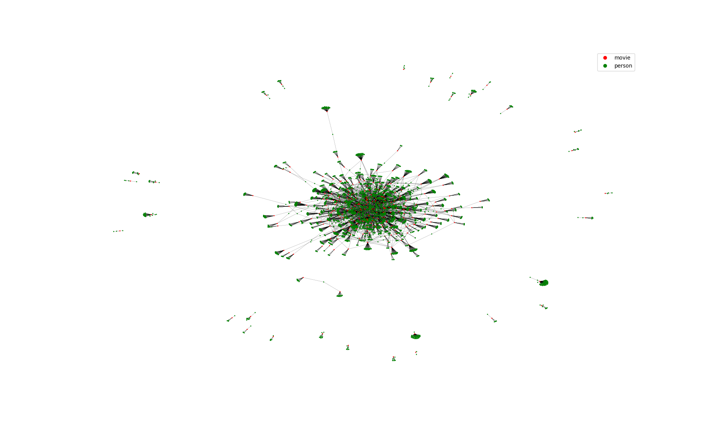

Network visualization
=====================
This section includes basic examples on network visualization.
 
Hairball plots
--------------
Hairball plots are conventional way of visualizing networks. Py3plex implements a simple, force layout-based visualization.

.. code-block:: python
   :linenos:

   from py3plex.visualization.multilayer import *
   from py3plex.visualization.colors import all_color_names
   from py3plex.core import multinet
   
   # initialize the network object
   multilayer_network = multinet.multi_layer_network()

   # load the file
   multilayer_network.load_network("imdb_gml.gml",directed=False,label_delimiter="---")

   # visualize
   network_colors, graph = multilayer_network.get_layers(style="hairball")
   hairball_plot(graph,network_colors)
   plt.show()

Multilayer plots
----------------
Multilayer plots are a novel approach developed by our group, aimed at displaying macro-level properties of network connectivity. Node types are split into many layers, which are connected via custom bernstein polynomial parameterization.

.. image:: multilayer.png

.. code-block:: python
   :linenos:

   from py3plex.visualization.multilayer import *
   from py3plex.visualization.colors import all_color_names
   from py3plex.core import multinet
   
   multilayer_network = multinet.multi_layer_network()
   multilayer_network.load_network("epigenetics.gpickle",
   directed=False, input_type="gpickle_biomine")
   multilayer_network.basic_stats() ## check core imports

   # get layer structure
   network_labels, graphs, multilinks = multilayer_network.get_layers()

   # draw
   draw_multilayer_default(graphs,display=False,background_shape="circle",labels=network_labels)

   enum = 1
   color_mappings = {idx : col for idx, col in enumerate(list(all_color_names.keys()))}
   for edge_type,edges in multilinks.items():
       draw_multiedges(graphs,edges,alphachannel=0.7,linepoints="-.",
       linecolor=color_mappings[enum],curve_height=5,linmod="upper",linewidth=0.4)
       enum+=1
   plt.show()

 
